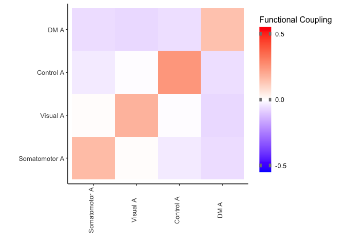
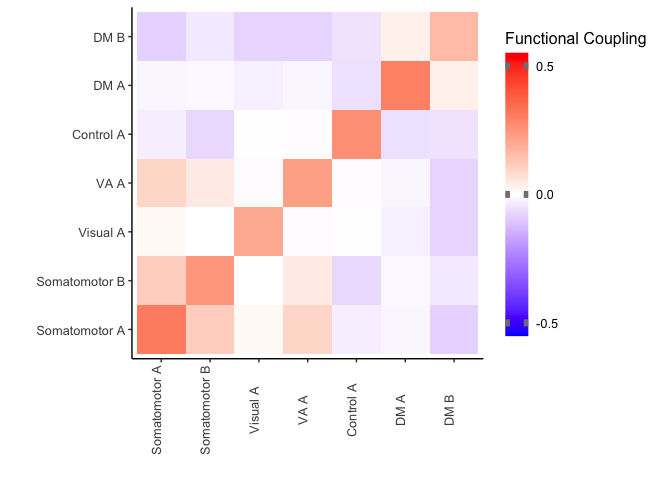
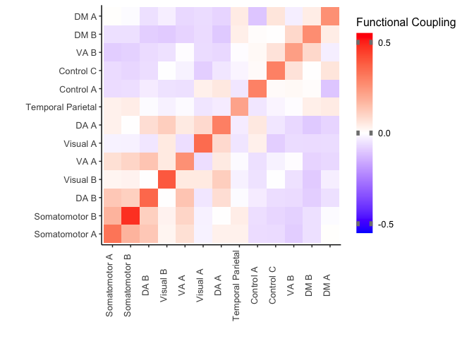
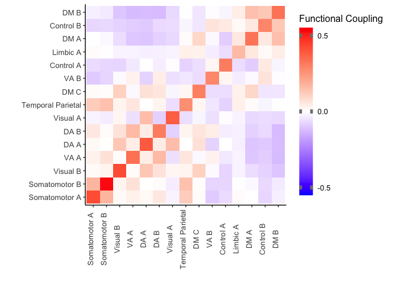

Average FC Matrices
================
Adam
6/29/2021

``` r
library(ggplot2)
library(reshape2)

### Get in Consensus-reference atlas correspondence
rac<-read.csv('/cbica/projects/pinesParcels/results/aggregated_data/fc/network_yCorrespondence_overscales.csv',stringsAsFactors = F)
scalesvec<-as.numeric(rac[2,])
domnetvec<-as.factor(rac[3,])
netpropvec<-as.numeric(rac[4,])
# 17 network version
rac17<-read.csv('/cbica/projects/pinesParcels/results/aggregated_data/fc/network_y17Correspondence_overscales.csv',stringsAsFactors = F)
scalesvec17<-as.numeric(rac17[2,])
domnetvec17<-as.factor(rac17[3,])
netpropvec17<-as.numeric(rac17[4,])
#### read in transmodality
tm<-read.csv('/cbica/projects/pinesParcels/results/aggregated_data/fc/network_transmodality_overscales.csv',stringsAsFactors = F)
colnames(tm)<-tm[1,]
# aaaand remove it so we got everything in its right place
tm<-tm[-c(1),]
tmvec<-as.numeric(tm)
# use median transmodality value to split relatively bimodal distribution
medtrans<-median(tmvec)
# equivalent vector to be overwritten with binary classification of transmodality
tmclass<-tmvec
for (i in 1:length(tmclass)){
  if (tmvec[i]<= medtrans){
    tmclass[i]='unimodal'
  }else{
    tmclass[i]='transmodal'
  }
}

grid.col = c(Motor = "#3281ab", Visual = "#670068", DA = "#007500", VA = '#b61ad0', FP = "#d77d00", DM = "#c1253c", Limbic = '#f0f9b8')

y7TMorder=c("Motor","Visual","DA","VA","Limbic","FP","DM")

# names for yeo17 correspondence
grid.col_y17=c(Control_A='#dc8303',Control_B='#8d2049',Control_C='#596a85',DA_A='#2d9a3d',DA_B='#007938',DM_A='#d9e200',DM_B='#bc0943',DM_C='#2b1f67',Limbic_A='#48593a',Limbic_B='#91a967',Somatomotor_A='#4183a8',Somatomotor_B='#00bb89',Temporal_Parietal='#3245a3',VA_A='#9e3ca2',VA_B='#eb75b3',Visual_A='#68126f',Visual_B='#d1001c')

Y7vec<-c('Motor','Visual','DA','VA','Limbic','FP','DM')

## needs the big one to be run y17vec<-levels(domnetvec17)

# set yeo colorset
ycolors=c('#3281ab','#670068','#007500','#b61ad0','#b8cf86','#d77d00','#c1253c')
y17colors=c('#dc8303','#8d2049','#596a85','#2d9a3d','#007938','#d9e200','#bc0943','#2b1f67','#48593a','#91a967','#4183a8','#00bb89','#3245a3','#9e3ca2','#eb75b3','#68126f','#d1001c')

# remove '_' from domnetvec17
domnetvec17<-gsub('_',' ',domnetvec17)

for (K in c(4,7,13,20)){
  K_start=((K-1)*(K))/2
  K_end=(((K-1)*(K))/2)+K-1
  Kind<-K_start:K_end
  # change fc_Mat to fc_ageMat to plot fc matrix of age effects instead
  Avg_MatFn=paste('/cbica/projects/pinesParcels/results/EffectMats/fc_Mat_K',K,'.csv',sep='')
  Avg_Mat=as.matrix(read.csv(Avg_MatFn))
  # requires domnetvec to be ran in other rmd
  colnames(Avg_Mat)=domnetvec17[Kind]
  rownames(Avg_Mat)=domnetvec17[Kind]
  # get tmvec to arrange matrix by transmodality
  curTmRank<-order(tmvec[Kind])
  
  # if desired, COMMENT OUT TO OBSERVE ORIGINAL ORDER
  ReAr_Avg_Mat<-Avg_Mat[curTmRank,curTmRank]
  #ReArAgeEfMat<-AgeEfMat
  
  cormelt<-melt(ReAr_Avg_Mat)
  
  # format used for figures
  
#  print(ggplot(cormelt,aes(Var1,Var2,fill=value))+geom_tile() +
#    scale_fill_gradient2(low='blue',mid='white',high='red',midpoint = 0,limits=c(-.55,.55),breaks=c(-.5,0,.5),name='Functional Coupling',guide = guide_colorbar(ticks.colour = "gray50", ticks.linewidth = 7)) + 
#    coord_equal() +
#    xlab('')+ylab('')+theme_classic()+
#    theme(legend.key.height=unit(2.5,"cm"),text=element_text(size=30),axis.text.x = element_text(vjust=-.01,angle=90)))

  # format used for markdown
  
  print(ggplot(cormelt,aes(Var1,Var2,fill=value))+geom_tile() +
    scale_fill_gradient2(low='blue',mid='white',high='red',midpoint = 0,limits=c(-.55,.55),breaks=c(-.5,0,.5),name='Functional Coupling',guide = guide_colorbar(ticks.colour = "gray50", ticks.linewidth = 7)) + 
    coord_equal() +
    xlab('')+ylab('')+theme_classic()+
    theme(legend.key.height=unit(1.5,"cm"),text=element_text(size=12),axis.text.x = element_text(vjust=-.01,angle=90)))
  
}
```


