BwRSqCentric
================
Adam
9/7/2020

``` r
# need to 
source('~/cbica/projects/pinesParcels/multiscale/scripts/analyses/correlations_over_scalesplot_minor.R')
library(shapes)
library(ggplot2)
```

    ## Warning: package 'ggplot2' was built under R version 3.5.2

``` r
library(reshape2)
library(dplyr)
```

    ## 
    ## Attaching package: 'dplyr'

    ## The following objects are masked from 'package:stats':
    ## 
    ##     filter, lag

    ## The following objects are masked from 'package:base':
    ## 
    ##     intersect, setdiff, setequal, union

``` r
library(ggpubr)
```

    ## Warning: package 'ggpubr' was built under R version 3.5.2

    ## Loading required package: magrittr

    ## 
    ## Attaching package: 'magrittr'

    ## The following objects are masked from 'package:shapes':
    ## 
    ##     add, mod

``` r
library(vroom)
library(data.table)
```

    ## Warning: package 'data.table' was built under R version 3.5.2

    ## 
    ## Attaching package: 'data.table'

    ## The following objects are masked from 'package:dplyr':
    ## 
    ##     between, first, last

    ## The following objects are masked from 'package:reshape2':
    ## 
    ##     dcast, melt

``` r
library(mgcv)
```

    ## Warning: package 'mgcv' was built under R version 3.5.2

    ## Loading required package: nlme

    ## 
    ## Attaching package: 'nlme'

    ## The following object is masked from 'package:dplyr':
    ## 
    ##     collapse

    ## This is mgcv 1.8-31. For overview type 'help("mgcv-package")'.

``` r
library(ggpointdensity)
```

    ## Warning: package 'ggpointdensity' was built under R version 3.5.2

``` r
library(ppcor)
```

    ## Loading required package: MASS

    ## Warning: package 'MASS' was built under R version 3.5.2

    ## 
    ## Attaching package: 'MASS'

    ## The following object is masked from 'package:dplyr':
    ## 
    ##     select

``` r
library(viridis)
```

    ## Loading required package: viridisLite

``` r
# load in demo
demo<-read.csv('/cbica/projects/pinesParcels/data/pnc_demo.csv')
ageSex<-data.frame(demo$ageAtScan1,as.factor(demo$sex),demo$scanid,demo$bblid)
subjects<-read.csv('/cbica/projects/pinesParcels/data/participants.txt',header = F)

###M MOTION METRIC M###
Rest_Motion_Data <- read.csv("/cbica/projects/pinesParcels/data/n1601_RestQAData_20170714.csv")
NBack_Motion_Data <- read.csv("/cbica/projects/pinesParcels/data/n1601_NBACKQAData_20181001.csv")
Idemo_Motion_Data <- read.csv("/cbica/projects/pinesParcels/data/n1601_idemo_FinalQA_092817.csv")

motmerge<-merge(Rest_Motion_Data,NBack_Motion_Data,by='bblid')
motmerge<-merge(motmerge,Idemo_Motion_Data,by='bblid')
motmerge$Motion <- (motmerge$restRelMeanRMSMotion + motmerge$nbackRelMeanRMSMotion + motmerge$idemoRelMeanRMSMotion)/3;
motiondf<-data.frame(motmerge$bblid,motmerge$Motion)
colnames(motiondf)<-c('bblid','Motion')
###M                 M###

colnames(subjects)<-c("scanid")
colnames(ageSex)<-c("Age","Sex","scanid","bblid")
df<-merge(subjects,ageSex,by="scanid")
df<-merge(df,motiondf,by='bblid')
# community solutions guaged in this iteration
community_vec<-seq(2,30)
```

``` r
### it's rounded now bb
fc<-vroom('/cbica/projects/pinesParcels/results/aggregated_data/fc/master_fcfeats_rounded.csv')
```

    ## New names:
    ## * `` -> ...1
    ## * Subjects -> Subjects...5455
    ## * Subjects -> Subjects...10908

    ## Rows: 695
    ## Columns: 16,360
    ## Delimiter: ","
    ## dbl [16360]: , bblid, ind_globseg_scale2, ind_globseg_scale3, ind_globseg_scale4, ind_globseg_sc...
    ## 
    ## Use `spec()` to retrieve the guessed column specification
    ## Pass a specification to the `col_types` argument to quiet this message

``` r
# take out row number row
fc<-fc[-c(1)]

# isolate shams (although merge should take them out later)
shams<-fc[694:695,]

# AGE
masterdf<-merge(fc,df,by='bblid')

# indicators of processing stream
ind='ind'
gro='gro'
bts='bts'

# indicators of fc feature type
bwi='_bw_FC_'
wini='_win_FC_'
nsegi='_seg_scale'
gsegi='_globseg_scale'

# indices of said indicators
indiv=grep(ind,colnames(masterdf))
group=grep(gro,colnames(masterdf))
basists=grep(bts,colnames(masterdf))
bwcol=grep(bwi,colnames(masterdf))
wincols=grep(wini,colnames(masterdf))
nsegcols=grep(nsegi,colnames(masterdf))
gsegcols=grep(gsegi,colnames(masterdf))
```

``` r
GBw=vroom('/cbica/projects/pinesParcels/results/aggregated_data/fc/globalBw_fcfeats.csv')
```

    ## Rows: 696
    ## Columns: 30
    ## Delimiter: ","
    ## chr [30]: df_gbw1, df_gbw2, df_gbw3, df_gbw4, df_gbw5, df_gbw6, df_gbw7, df_gbw8, df_gbw9,...
    ## 
    ## Use `spec()` to retrieve the guessed column specification
    ## Pass a specification to the `col_types` argument to quiet this message

``` r
GWin=vroom('/cbica/projects/pinesParcels/results/aggregated_data/fc/globalWin_fcfeats.csv')
```

    ## Rows: 696
    ## Columns: 30
    ## Delimiter: ","
    ## chr [30]: df_gw1, df_gw2, df_gw3, df_gw4, df_gw5, df_gw6, df_gw7, df_gw8, df_gw9, df_gw10,...
    ## 
    ## Use `spec()` to retrieve the guessed column specification
    ## Pass a specification to the `col_types` argument to quiet this message

``` r
colnames(GBw)<-unlist(GBw[1,])
colnames(GWin)<-unlist(GWin[1,])

# identical parsing as above

GBw<-data.frame(GBw)
GWin<-data.frame(GWin)

# round ridiculous number of decimal points
GBw[] <- lapply(GBw, function(x) {
  if(is.character(x)) round(as.numeric(as.character(x)),digits=3) else x
})
```

    ## Warning in FUN(X[[i]], ...): NAs introduced by coercion

    ## Warning in FUN(X[[i]], ...): NAs introduced by coercion

    ## Warning in FUN(X[[i]], ...): NAs introduced by coercion

    ## Warning in FUN(X[[i]], ...): NAs introduced by coercion

    ## Warning in FUN(X[[i]], ...): NAs introduced by coercion

    ## Warning in FUN(X[[i]], ...): NAs introduced by coercion

    ## Warning in FUN(X[[i]], ...): NAs introduced by coercion

    ## Warning in FUN(X[[i]], ...): NAs introduced by coercion

    ## Warning in FUN(X[[i]], ...): NAs introduced by coercion

    ## Warning in FUN(X[[i]], ...): NAs introduced by coercion

    ## Warning in FUN(X[[i]], ...): NAs introduced by coercion

    ## Warning in FUN(X[[i]], ...): NAs introduced by coercion

    ## Warning in FUN(X[[i]], ...): NAs introduced by coercion

    ## Warning in FUN(X[[i]], ...): NAs introduced by coercion

    ## Warning in FUN(X[[i]], ...): NAs introduced by coercion

    ## Warning in FUN(X[[i]], ...): NAs introduced by coercion

    ## Warning in FUN(X[[i]], ...): NAs introduced by coercion

    ## Warning in FUN(X[[i]], ...): NAs introduced by coercion

    ## Warning in FUN(X[[i]], ...): NAs introduced by coercion

    ## Warning in FUN(X[[i]], ...): NAs introduced by coercion

    ## Warning in FUN(X[[i]], ...): NAs introduced by coercion

    ## Warning in FUN(X[[i]], ...): NAs introduced by coercion

    ## Warning in FUN(X[[i]], ...): NAs introduced by coercion

    ## Warning in FUN(X[[i]], ...): NAs introduced by coercion

    ## Warning in FUN(X[[i]], ...): NAs introduced by coercion

    ## Warning in FUN(X[[i]], ...): NAs introduced by coercion

    ## Warning in FUN(X[[i]], ...): NAs introduced by coercion

    ## Warning in FUN(X[[i]], ...): NAs introduced by coercion

    ## Warning in FUN(X[[i]], ...): NAs introduced by coercion

    ## Warning in FUN(X[[i]], ...): NAs introduced by coercion

``` r
GWin[] <- lapply(GWin, function(x) {
  if(is.character(x)) round(as.numeric(as.character(x)),digits=3) else x
})
```

    ## Warning in FUN(X[[i]], ...): NAs introduced by coercion

    ## Warning in FUN(X[[i]], ...): NAs introduced by coercion

    ## Warning in FUN(X[[i]], ...): NAs introduced by coercion

    ## Warning in FUN(X[[i]], ...): NAs introduced by coercion

    ## Warning in FUN(X[[i]], ...): NAs introduced by coercion

    ## Warning in FUN(X[[i]], ...): NAs introduced by coercion

    ## Warning in FUN(X[[i]], ...): NAs introduced by coercion

    ## Warning in FUN(X[[i]], ...): NAs introduced by coercion

    ## Warning in FUN(X[[i]], ...): NAs introduced by coercion

    ## Warning in FUN(X[[i]], ...): NAs introduced by coercion

    ## Warning in FUN(X[[i]], ...): NAs introduced by coercion

    ## Warning in FUN(X[[i]], ...): NAs introduced by coercion

    ## Warning in FUN(X[[i]], ...): NAs introduced by coercion

    ## Warning in FUN(X[[i]], ...): NAs introduced by coercion

    ## Warning in FUN(X[[i]], ...): NAs introduced by coercion

    ## Warning in FUN(X[[i]], ...): NAs introduced by coercion

    ## Warning in FUN(X[[i]], ...): NAs introduced by coercion

    ## Warning in FUN(X[[i]], ...): NAs introduced by coercion

    ## Warning in FUN(X[[i]], ...): NAs introduced by coercion

    ## Warning in FUN(X[[i]], ...): NAs introduced by coercion

    ## Warning in FUN(X[[i]], ...): NAs introduced by coercion

    ## Warning in FUN(X[[i]], ...): NAs introduced by coercion

    ## Warning in FUN(X[[i]], ...): NAs introduced by coercion

    ## Warning in FUN(X[[i]], ...): NAs introduced by coercion

    ## Warning in FUN(X[[i]], ...): NAs introduced by coercion

    ## Warning in FUN(X[[i]], ...): NAs introduced by coercion

    ## Warning in FUN(X[[i]], ...): NAs introduced by coercion

    ## Warning in FUN(X[[i]], ...): NAs introduced by coercion

    ## Warning in FUN(X[[i]], ...): NAs introduced by coercion

    ## Warning in FUN(X[[i]], ...): NAs introduced by coercion

``` r
# isolate shams (although merge should take them out later)
shams<-fc[694:695,]

# set subjects column to bblid
colnames(GWin)[1]<-'bblid'
colnames(GBw)[1]<-'bblid'
GWindf<-merge(GWin,df,by='bblid')
GBwdf<-merge(GBw,df,by='bblid')

### isolate global columns
gWincols<-grep("globWin",colnames(GWindf))
gBwcols<-grep("globBw",colnames(GBwdf))
#paste("Indices of global segregation columns at ",gsegcols)

### plot mean global seg over scales by age
# 2:30 is ind, 5455:5483 is group
indglobWin<-cbind(GWindf$bblid,GWindf$Age/12,GWindf$Sex,GWindf$Motion,GWindf[,2:30])
indglobBw<-cbind(GBwdf$bblid,GBwdf$Age/12,GBwdf$Sex,GBwdf$Motion,GBwdf[,2:30])

# set colnames
colnames(indglobWin)[1:4]<-c("bblid", "Age","Sex","Motion")
colnames(indglobBw)[1:4]<-c("bblid", "Age","Sex","Motion")
colnames(indglobWin)[5:33]<-as.character(2:30)
colnames(indglobBw)[5:33]<-as.character(2:30)
indglobWin$Sex<-as.factor(indglobWin$Sex)
indglobBw$Sex<-as.factor(indglobBw$Sex)

# regress effect of age out on sex and motion
indglobWin_motSexC<-indglobWin
indglobBw_motSexC<-indglobBw

for (i in 5:33){
  WCLM<-lm(indglobWin[,i]~Motion+Sex,data=indglobWin)
  indglobWin_motSexC[,i]<-WCLM$residuals
  BWCLM<-lm(indglobBw_motSexC[,i]~Motion+Sex,data=indglobBw)
  indglobBw_motSexC[,i]<-BWCLM$residuals
  # add in mean for more interpretable values
  indglobWin_motSexC[,i]<-indglobWin_motSexC[,i]+mean(indglobWin[,i])
  indglobBw_motSexC[,i]<-indglobBw_motSexC[,i]+mean(indglobBw[,i])
}


# melt it
mindglobwin<-melt(indglobWin_motSexC, id=c(1,2,3,4))
```

    ## Warning in melt(indglobWin_motSexC, id = c(1, 2, 3, 4)): The melt generic in
    ## data.table has been passed a data.frame and will attempt to redirect to the
    ## relevant reshape2 method; please note that reshape2 is deprecated, and this
    ## redirection is now deprecated as well. To continue using melt methods from
    ## reshape2 while both libraries are attached, e.g. melt.list, you can prepend the
    ## namespace like reshape2::melt(indglobWin_motSexC). In the next version, this
    ## warning will become an error.

``` r
mgroglobbw<-melt(indglobBw_motSexC, id=c(1,2,3,4))
```

    ## Warning in melt(indglobBw_motSexC, id = c(1, 2, 3, 4)): The melt generic in
    ## data.table has been passed a data.frame and will attempt to redirect to the
    ## relevant reshape2 method; please note that reshape2 is deprecated, and this
    ## redirection is now deprecated as well. To continue using melt methods from
    ## reshape2 while both libraries are attached, e.g. melt.list, you can prepend
    ## the namespace like reshape2::melt(indglobBw_motSexC). In the next version, this
    ## warning will become an error.

``` r
WinAll<-ggplot(data=mindglobwin,aes(x=as.numeric(as.character(variable)),y=value,group=bblid,color=Age)) +geom_line(alpha = 0.12)+scale_color_gradientn(colors=c("yellow","purple")) + theme_minimal(base_size = 28)+labs(title="M/S-Regressed Glob. Within - Individ. Partitions") + scale_x_continuous(name ="# of Communitites",  breaks=seq(2, 30, 4))+ylab("Global Within")

BwAll<-ggplot(data=mgroglobbw,aes(x=as.numeric(as.character(variable)),y=value,group=bblid,color=Age)) +geom_line(alpha = 0.12)+scale_color_gradientn(colors=c("yellow","purple")) + theme_minimal(base_size = 28)+labs(title="M/S-Regressed Glob. Bw - Individ. Partitions") + scale_x_continuous(name ="# of Communitites",  breaks=seq(2, 30, 4))+ylab("Global Between")

### Now with motion + sex control
# 29 for scales studied
ind_GWincors<-matrix(0,29,2)
ind_GWincors[,1]<-2:30
ind_GBwcors<-matrix(0,29,2)
ind_GBwcors[,1]<-2:30

for (i in 1:29){
  # i+4 because first column is scanid, second is age, third is sex, 4th is motion
  print(ggplot(indglobWin_motSexC,aes(Age,indglobWin_motSexC[,i+4])) + geom_point() + geom_smooth() +ylab(paste("Ind Global Win at Scale", i+1)))
   # print(ggplot(indglobBw_motSexC,aes(Age,indglobBw_motSexC[,i+4])) + geom_point() + geom_smooth() +ylab(paste("Ind Global BW at Scale", i+1)))
  
# relevant df
  Winscaledf<-cbind(indglobWin$Age,indglobWin$Sex,indglobWin$Motion,indglobWin[,i+4])
  Bwscaledf<-cbind(indglobBw$Age,indglobBw$Sex,indglobBw$Motion,indglobBw[,i+4])
  # partial spearmans to extrac age relation
  pspear=pcor(Winscaledf,method='spearman')$estimate
  ind_GWincors[i,2]<-pspear[4]
  pspear=pcor(Bwscaledf,method='spearman')$estimate
  ind_GBwcors[i,2]<-pspear[4]
}
```

    ## `geom_smooth()` using method = 'loess' and formula 'y ~ x'

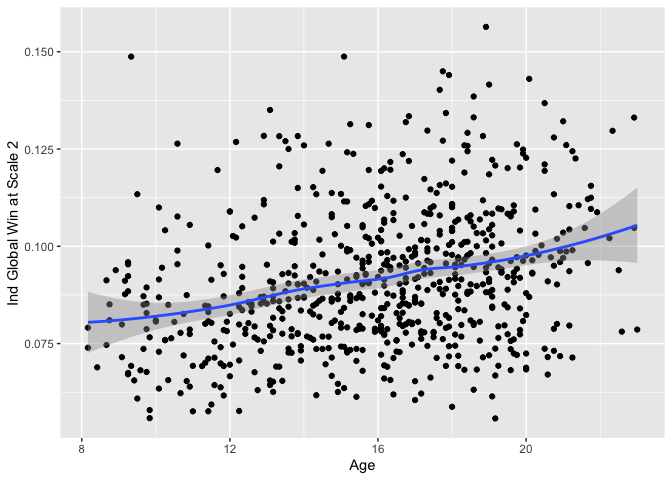

    ## `geom_smooth()` using method = 'loess' and formula 'y ~ x'

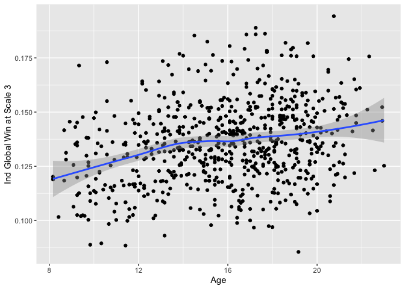

    ## `geom_smooth()` using method = 'loess' and formula 'y ~ x'

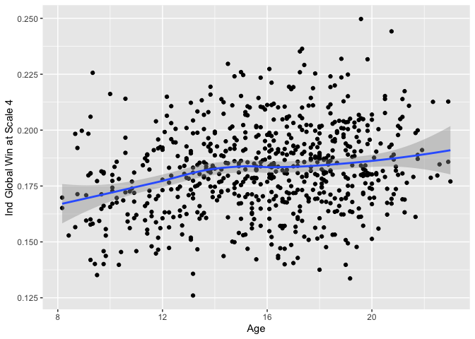

    ## `geom_smooth()` using method = 'loess' and formula 'y ~ x'

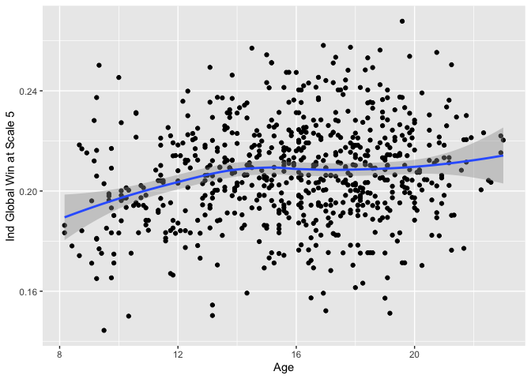

    ## `geom_smooth()` using method = 'loess' and formula 'y ~ x'

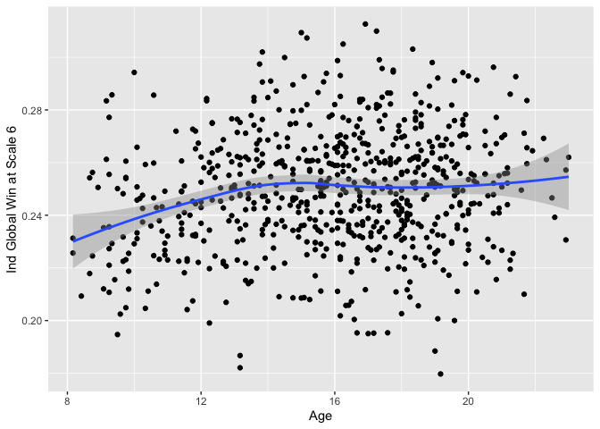

    ## `geom_smooth()` using method = 'loess' and formula 'y ~ x'

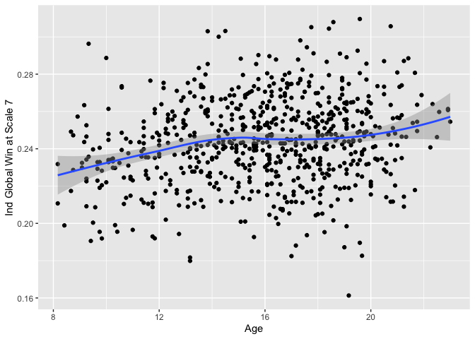

    ## `geom_smooth()` using method = 'loess' and formula 'y ~ x'

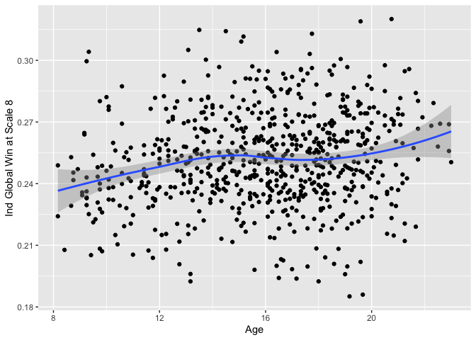

    ## `geom_smooth()` using method = 'loess' and formula 'y ~ x'

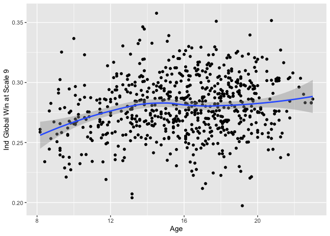

    ## `geom_smooth()` using method = 'loess' and formula 'y ~ x'

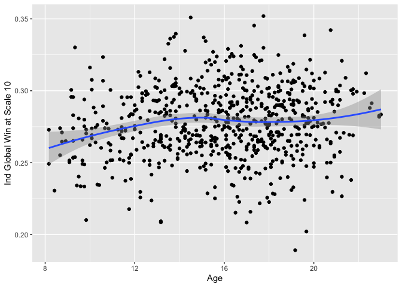

    ## `geom_smooth()` using method = 'loess' and formula 'y ~ x'

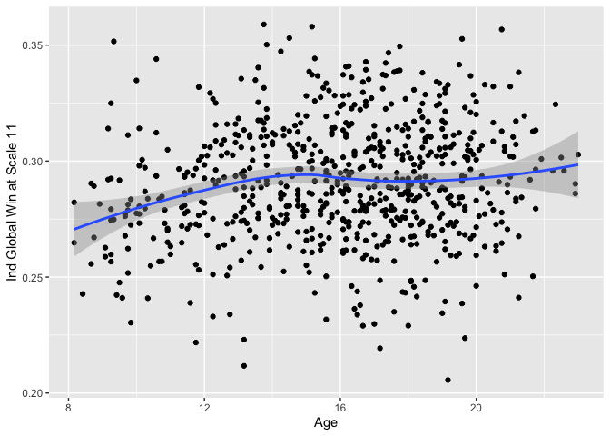

    ## `geom_smooth()` using method = 'loess' and formula 'y ~ x'

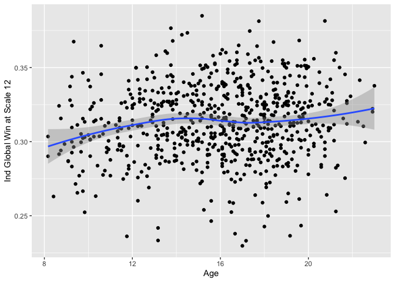

    ## `geom_smooth()` using method = 'loess' and formula 'y ~ x'

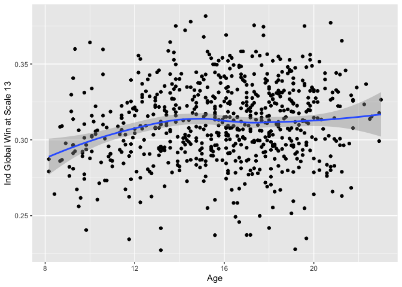

    ## `geom_smooth()` using method = 'loess' and formula 'y ~ x'

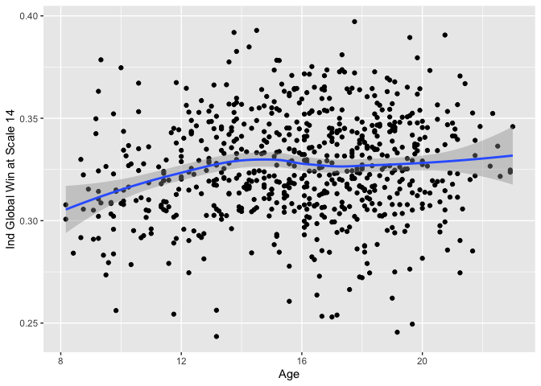

    ## `geom_smooth()` using method = 'loess' and formula 'y ~ x'


    ## `geom_smooth()` using method = 'loess' and formula 'y ~ x'

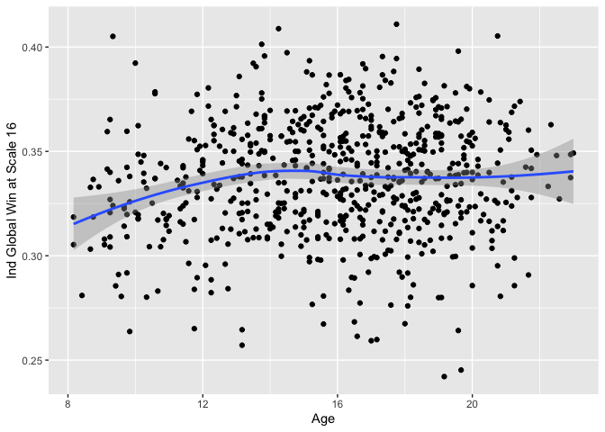

    ## `geom_smooth()` using method = 'loess' and formula 'y ~ x'

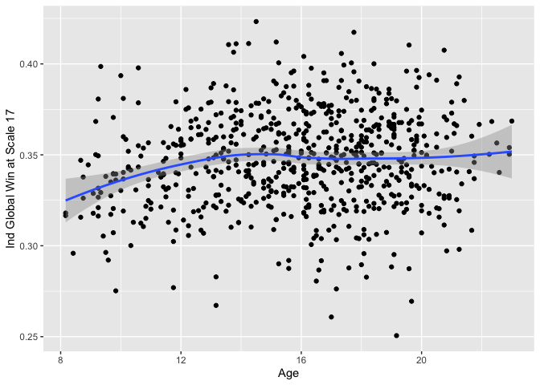

    ## `geom_smooth()` using method = 'loess' and formula 'y ~ x'

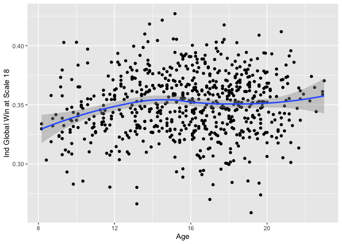

    ## `geom_smooth()` using method = 'loess' and formula 'y ~ x'

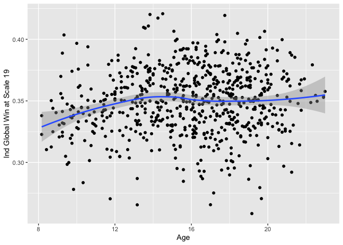

    ## `geom_smooth()` using method = 'loess' and formula 'y ~ x'

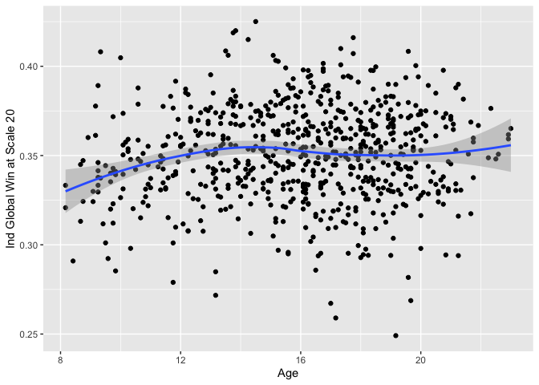

    ## `geom_smooth()` using method = 'loess' and formula 'y ~ x'

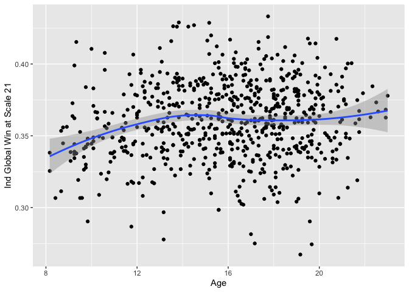

    ## `geom_smooth()` using method = 'loess' and formula 'y ~ x'

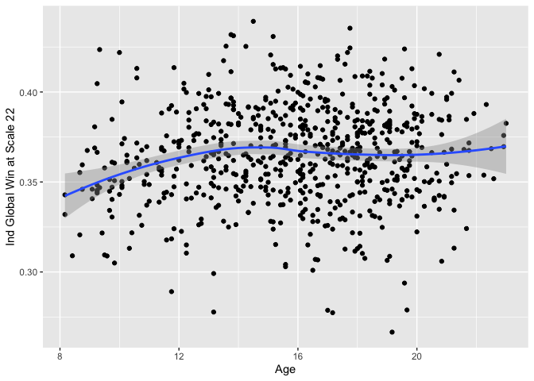

    ## `geom_smooth()` using method = 'loess' and formula 'y ~ x'

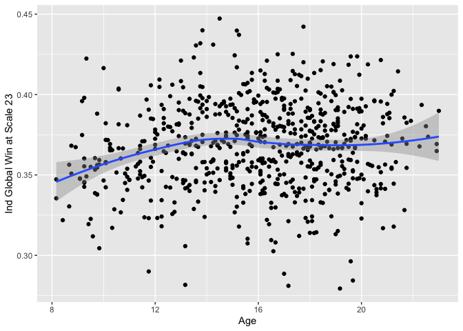

    ## `geom_smooth()` using method = 'loess' and formula 'y ~ x'

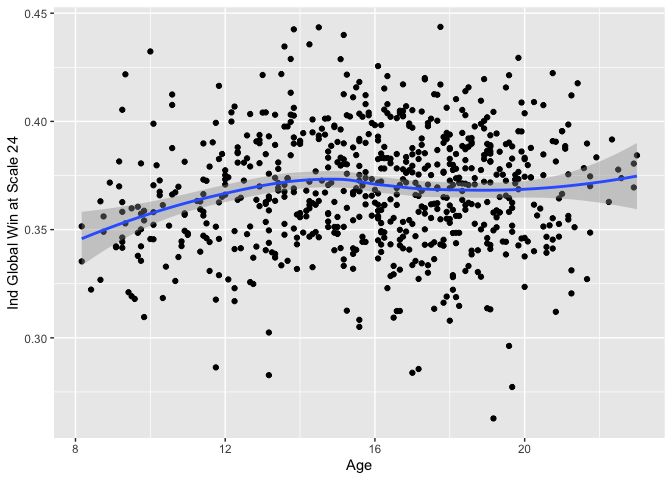

    ## `geom_smooth()` using method = 'loess' and formula 'y ~ x'

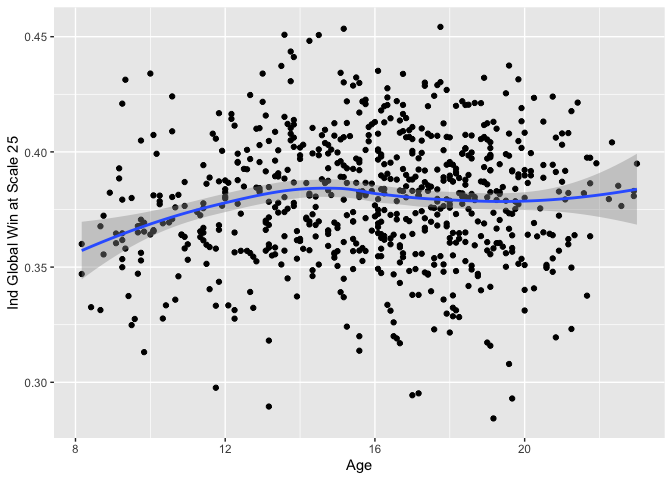

    ## `geom_smooth()` using method = 'loess' and formula 'y ~ x'

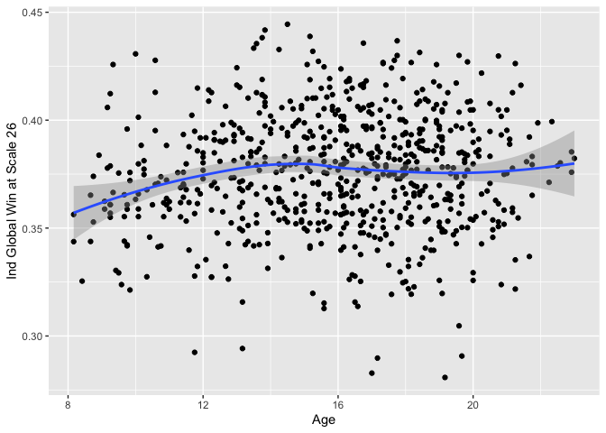

    ## `geom_smooth()` using method = 'loess' and formula 'y ~ x'

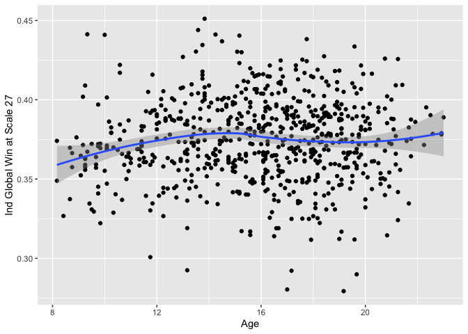

    ## `geom_smooth()` using method = 'loess' and formula 'y ~ x'

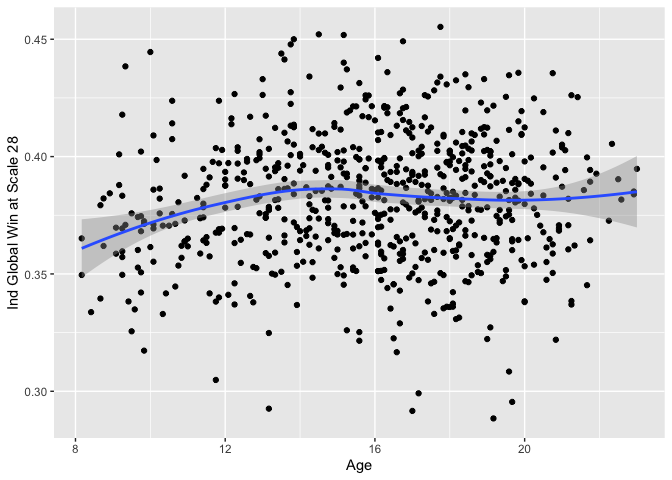

    ## `geom_smooth()` using method = 'loess' and formula 'y ~ x'

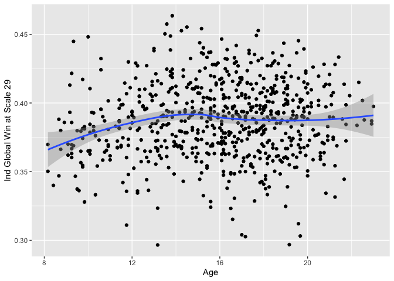

    ## `geom_smooth()` using method = 'loess' and formula 'y ~ x'

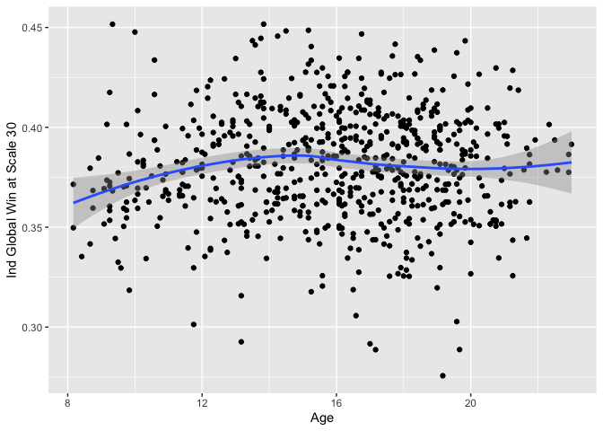

``` r
WinCors<-correlations_over_scales(ind_GWincors,"Global WithinCon Age Correlation")

BwCors<-correlations_over_scales(ind_GBwcors,"Global BetweenCon Age Correlation")

#ggarrange(WinAll,WinCors,BwAll,BwCors)
BwAll
```

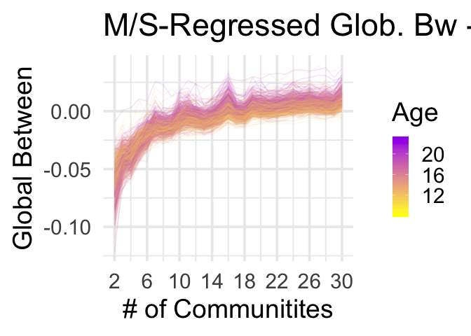

``` r
BwCors
```

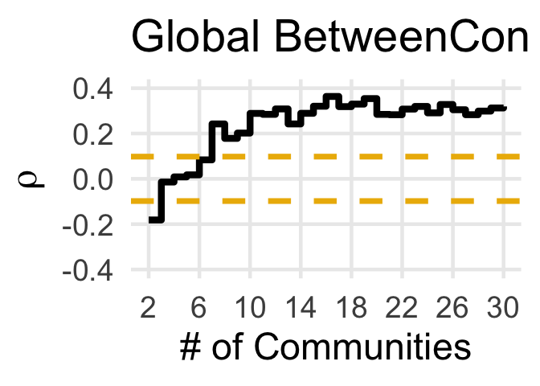

``` r
### Get in Consensus-reference atlas correspondence
rac<-read.csv('/cbica/projects/pinesParcels/results/aggregated_data/fc/network_yCorrespondence_overscales.csv',stringsAsFactors = F)
scalesvec<-as.numeric(rac[2,])
domnetvec<-as.factor(rac[3,])
netpropvec<-as.numeric(rac[4,])

# 17 network version
### Get in Consensus-reference atlas correspondence
rac17<-read.csv('/cbica/projects/pinesParcels/results/aggregated_data/fc/network_y17Correspondence_overscales.csv',stringsAsFactors = F)
scalesvec17<-as.numeric(rac17[2,])
domnetvec17<-as.factor(rac17[3,])
netpropvec17<-as.numeric(rac17[4,])


#### read in transmodality
tm<-read.csv('/cbica/projects/pinesParcels/results/aggregated_data/fc/network_transmodality_overscales.csv',stringsAsFactors = F)
colnames(tm)<-tm[1,]
# aaaand remove it
tm<-tm[-c(1),]
tmvec<-as.numeric(tm)

# distribution of transmodality across networks across scales (derived from group consensus)
hist(tmvec,12,xlab="Transmodality",ylab="Count",ylim=c(0,70), main=NULL,col="grey")
```


``` r
# use median transmodality value to split relatively bimodal distribution
medtrans<-median(tmvec)
# equivalent vector to be overwritten with binary classification of transmodality
tmclass<-tmvec
for (i in 1:length(tmclass)){
  if (tmvec[i]<= medtrans){
    tmclass[i]='unimodal'
  }else{
    tmclass[i]='transmodal'
  }
}
```

``` r
### Using a tongue of index combinations 
indiv_bwcols_ind<-intersect(bwcol,indiv)
individ_scalebybw_df<-masterdf[,indiv_bwcols_ind]
indiv_wincols_ind<-intersect(wincols,indiv)
individ_scalebywin_df<-masterdf[,indiv_wincols_ind]
# to later use wincolname -> bwcolname mapping to extrapolate if if network is unimodal or transmodal along bwcol indices
wincolnames<-colnames(individ_scalebywin_df)
bwcolnames<-colnames(individ_scalebybw_df)

# empty array to populate with b/w connectivity age cors (b/w to unimodal, b/w to transmodal, b/w to aggregate, and K and N and Modality just to confirm we are matching)
bwAgeCorVecs<-matrix(0,464,6)

# loop over connectivities to-unimodal then to-transmodal
modalloopvar=c('unimodal','transmodal')
for (i in 1:2){
  print(modalloopvar[i])
  # index "the other" (dystopian)
  modalloopvar_other=modalloopvar[modalloopvar!=(modalloopvar[i])]
  # extract which of 1:464 network mappings match the modalitity of this loop
  modalindices=which(tmclass %in% modalloopvar[i])
  # loop over each scale
    for (K in 2:30){
    # Make index of where values from this K should go
      K_start=((K-1)*(K))/2
      K_end=(((K-1)*(K))/2)+K-1
      Kind<-K_start:K_end
      bwAgeCorVecs[Kind,4]=K
    
    # index which values are at this scale
    scaleStr=paste('scale',K,'_',sep='')
    scaleCols_inds=grep(scaleStr,colnames(masterdf))
    scaleK_bw_indivi_cols_inds<-intersect(indiv_bwcols_ind,scaleCols_inds)
    # extract within and between colnames at this scale for within->b/w binarized transmodality mapping
    wincolnames_thisScale_inds<-grep((paste('scale',K,'_',sep='')),wincolnames)
    wincolnames_thisScale=wincolnames[wincolnames_thisScale_inds]
    bwcolnames_thisScale_inds<-grep((paste('scale',K,'_',sep='')),bwcolnames)
    bwcolnames_thisScale=bwcolnames[bwcolnames_thisScale_inds]
    
    # This was to double check that the "scale" grepping was selective enough
    # print(paste(scaleStr,'number of features:',length(bwcolnames_thisScale)))
  # one weird trick to get binarized transmodality class vector for same scale (Doctors hate him!)
    # tm naming aligns with wincon naming
    tmclasses_thisScale<-tmclass[wincolnames_thisScale_inds]
    # extract the network number of each network at this scale in same order as tmclasses_thisScale
    wincolNamesSplit<-strsplit(wincolnames_thisScale,"_net")
    wincolNames_net<-sapply(wincolNamesSplit, "[[" , 2)
    # mini matching vectors with network label at this scale in one col and transmodality binarization in the other
    tmMatchingVecs<-cbind(wincolNames_net,tmclasses_thisScale)
    # remove scale number from strings so we're not picking up on those
    bwcolnames_thisScale_split<-strsplit(bwcolnames_thisScale,"nets")
    bwnetnames_thisScale<-wincolNames_net<-sapply(bwcolnames_thisScale_split, "[[" , 2)
    # add another fucking set of underscores to all of these colnames so 1's dont pick up 10s
    bwnetnames_thisScale_extended<-paste('ind_bw_FC_scale',K,'_nets_',bwnetnames_thisScale,'_',sep='')
    # extra goddamn undercores have to go here and be removed later
    bwcolnames_thisScale_split<-strsplit(bwcolnames_thisScale,"nets")
    # to be matched in all-networks-at-this-scale loop
    # now as we descend into the third circle of for-loop hell, we find the guy from man vs.food being eaten alive by cerberus
    for (N in 1:K){
      # generate index for where values for this network at this scale should reside
      # start from K index
      Nind<-Kind[N]
      bwAgeCorVecs[Nind,5]=N
      # get index for this N in terms of masterdf (collapse | to match multiple patterns)
      Ncolname<-grep(as.character(paste('_',N,'_',sep='')),bwnetnames_thisScale_extended,value=T)
      # need to add "_" before and after each number so I can select for '_N_' and not pick up teens digits with 1, 20s with 3, 15 and 25 with 5, etc.
      # determine if this network is transmodal or unimodal
      NModality<-tmMatchingVecs[,2][[N]]
      ########bwAgeCorVecs[Nind,6]<-NModality
      NotNModality<-modalloopvar[modalloopvar!=NModality]
      matchvec<-grep(NModality,tmclasses_thisScale)
      # remove self
      matchvec<-matchvec[matchvec!=N]
      # build index of matching modalities to reference masterdf (collapse | to match multiple patterns)
      matchTruncColName<-grep(as.character(paste('_',matchvec,'_',sep='',collapse="|")),Ncolname,value=T)
      # remove first and last characters now that we are specific
      #matchTruncColName<-sub('.$','',matchTruncColName)
      #matchTruncColName<-sub('.','',matchTruncColName)
      # deal with weird thing where empty space was being grepped because of its aspecificity at coarse scales
      if(length(matchTruncColName)==0){
        matchTruncColName[1]='CANTSEEME'
      }
      match_NetN_scaleK_bw_indivi_cols_ind_within_other_ind<-grep(as.character(paste(matchTruncColName,collapse="|")),bwnetnames_thisScale_extended)
      match_NetN_scaleK_bw_indivi_cols_names<-bwcolnames_thisScale[match_NetN_scaleK_bw_indivi_cols_ind_within_other_ind]
      # deep-sea grepping the whole paste and pipe thing is just to deal with character vectors instead of single patterns
      
      # deal with weird thing where empty space was being grepped because of its aspecificity
      if(length(match_NetN_scaleK_bw_indivi_cols_names)==0){
        match_NetN_scaleK_bw_indivi_cols_names[1]='CANTSEEME'
      }
      #################
      #### NEED TO ADD UNDERSCORE TO AFTERPORTION SO IT DOESNT PICK UP 1_20 when looking for 1_2 #########
      ##########
      #bwcolnames_thisScale<-paste(bwcolnames_thisScale,'_',sep='')
      #match_NetN_scaleK_bw_indivi_cols_names<-paste(match_NetN_scaleK_bw_indivi_cols_names,'_',sep='')
      
      # added a faux '_' to end of column to col names can more selectively match numbers (not picking up on 20 when looking for 2, 2_ and 20_ more distinct)
      match_NetN_scaleK_bw_indivi_cols_ind<-grep(as.character(paste(match_NetN_scaleK_bw_indivi_cols_names,'_',sep='',collapse="|")),paste(colnames(masterdf),'_',sep=''))
    
      ###############
      ######## find opposite modality in this scale ################
      ###############
      
      oppositevec<-grep(NotNModality,tmclasses_thisScale)
      
      # build index of NON-matching modalities to reference masterdf (collapse | to match multiple patterns)
      unmatchTruncColName<-grep(as.character(paste('_',oppositevec,'_',sep='',collapse="|")),Ncolname,value=T)
      # search for string in limited bwcolnames at this scale so as not to invite other scales into this grep party
      # remove first and last characters now that we are specific
      #unmatchTruncColName<-sub('.$','',unmatchTruncColName)
      #unmatchTruncColName<-sub('.','',unmatchTruncColName)
      unmatch_NetN_scaleK_bw_indivi_cols_names<-grep(as.character(paste(unmatchTruncColName,collapse="|")),bwnetnames_thisScale_extended,value=T)
      
      # deep-sea grepping the whole paste and pipe thing is just to deal with character vectors instead of single patterns
      unmatch_NetN_scaleK_bw_indivi_cols_ind_within_other_ind<-grep(as.character(paste(unmatch_NetN_scaleK_bw_indivi_cols_names,collapse="|")),bwnetnames_thisScale_extended)
      unmatch_NetN_scaleK_bw_indivi_cols_names<-bwcolnames_thisScale[unmatch_NetN_scaleK_bw_indivi_cols_ind_within_other_ind]
      unmatch_NetN_scaleK_bw_indivi_cols_ind<-grep(as.character(paste(unmatch_NetN_scaleK_bw_indivi_cols_names,'_',sep='',collapse="|")),paste(colnames(masterdf),'_',sep=''))
      
      
      # doublecheck that they are mutually exclusive (+1 because self-reference gets removed)
    #  if(length(tmclasses_thisScale)!=length(matchvec)+length(oppositevec)+1){
   #     print('You done goofed, internet police are on their way')
     # }
      if(length(tmclasses_thisScale)!=length(match_NetN_scaleK_bw_indivi_cols_ind)+length(unmatch_NetN_scaleK_bw_indivi_cols_ind)+1){
        print('Names dont add up chief')
        paste('match numbas', length(match_NetN_scaleK_bw_indivi_cols_ind), length(match_NetN_scaleK_bw_indivi_cols_names))
        paste('unmatch numbas', length(unmatch_NetN_scaleK_bw_indivi_cols_ind), length(unmatch_NetN_scaleK_bw_indivi_cols_names))
        stopifnot(length(tmclasses_thisScale)==length(match_NetN_scaleK_bw_indivi_cols_ind)+length(unmatch_NetN_scaleK_bw_indivi_cols_ind)+1)
      }
      unmatch_NetN_scaleK_bw_indivi_cols_ind
      # Reset these to NULL for each loop over N for equivalent looping
      
      
      # if it matches the modality being aggregated in the grandparent loop, we wish to only assay its connections to same-modality networks
      if (NModality==modalloopvar[i] && length(matchvec>0)){
        avg_bw_agecor<-NULL
        # get average value of b/w but same modality connectivity
        avg_bw_same<-rowMeans(masterdf[,match_NetN_scaleK_bw_indivi_cols_ind,drop=F])
        # get mean agecor with matching networks
        avg_bw_agecor<-corEstVec(avg_bw_same)
      } else if (NModality!=modalloopvar[i]) {  
        avg_bw_agecor<-NULL
        # get average value of b/w but same modality connectivity
        avg_bw_dif<-rowMeans(masterdf[,unmatch_NetN_scaleK_bw_indivi_cols_ind, drop=F])
        # get mean agecor with non-matching networks
        avg_bw_agecor<-corEstVec(avg_bw_dif)
      } else if (NModality==modalloopvar[i] && (exists("matchvec[1]"))=='FALSE') {
        # easily findable index for cells which should not be filled (i.e., there is no "to unimodal connectivity" for the only unimodal networks at any scale)
        avg_bw_agecor<-999
      }
      # if it does not match the modality of the grandparent loop, we wish go assay its connections to opposite-modality networks
      bwAgeCorVecs[Nind,i]=avg_bw_agecor
    # get average bw network connectivty age correlation for this network at this scale
      both=cbind(masterdf[,match_NetN_scaleK_bw_indivi_cols_ind],masterdf[,unmatch_NetN_scaleK_bw_indivi_cols_ind, drop=F])
      avg_bw=rowMeans(both)
      avg_bw_coarse_agecor<-DeltaR2EstVec(avg_bw)
      bwAgeCorVecs[Nind,3]=unlist(avg_bw_coarse_agecor)
    }
    # Print out ratio of transmodal to unimodal at this scale
    unilength=length(tmclasses_thisScale[tmclasses_thisScale=='unimodal'])
    translength=length(tmclasses_thisScale[tmclasses_thisScale=='transmodal'])
    print(paste('uni to trans ratio:', unilength/translength))
  }
  
}
```

    ## [1] "unimodal"
    ## [1] "uni to trans ratio: 1"
    ## [1] "uni to trans ratio: 2"
    ## [1] "uni to trans ratio: 1"
    ## [1] "uni to trans ratio: 0.666666666666667"
    ## [1] "uni to trans ratio: 1"
    ## [1] "uni to trans ratio: 0.75"
    ## [1] "uni to trans ratio: 1.66666666666667"
    ## [1] "uni to trans ratio: 1.25"
    ## [1] "uni to trans ratio: 1"
    ## [1] "uni to trans ratio: 0.833333333333333"
    ## [1] "uni to trans ratio: 1.4"
    ## [1] "uni to trans ratio: 1.16666666666667"
    ## [1] "uni to trans ratio: 1"
    ## [1] "uni to trans ratio: 1.5"
    ## [1] "uni to trans ratio: 1.28571428571429"
    ## [1] "uni to trans ratio: 1.125"
    ## [1] "uni to trans ratio: 1"
    ## [1] "uni to trans ratio: 1.375"
    ## [1] "uni to trans ratio: 1.22222222222222"
    ## [1] "uni to trans ratio: 1.1"
    ## [1] "uni to trans ratio: 1"
    ## [1] "uni to trans ratio: 0.916666666666667"
    ## [1] "uni to trans ratio: 0.846153846153846"
    ## [1] "uni to trans ratio: 1.08333333333333"
    ## [1] "uni to trans ratio: 0.857142857142857"
    ## [1] "uni to trans ratio: 0.8"
    ## [1] "uni to trans ratio: 1"
    ## [1] "uni to trans ratio: 0.8125"
    ## [1] "uni to trans ratio: 0.666666666666667"
    ## [1] "transmodal"
    ## [1] "uni to trans ratio: 1"
    ## [1] "uni to trans ratio: 2"
    ## [1] "uni to trans ratio: 1"
    ## [1] "uni to trans ratio: 0.666666666666667"
    ## [1] "uni to trans ratio: 1"
    ## [1] "uni to trans ratio: 0.75"
    ## [1] "uni to trans ratio: 1.66666666666667"
    ## [1] "uni to trans ratio: 1.25"
    ## [1] "uni to trans ratio: 1"
    ## [1] "uni to trans ratio: 0.833333333333333"
    ## [1] "uni to trans ratio: 1.4"
    ## [1] "uni to trans ratio: 1.16666666666667"
    ## [1] "uni to trans ratio: 1"
    ## [1] "uni to trans ratio: 1.5"
    ## [1] "uni to trans ratio: 1.28571428571429"
    ## [1] "uni to trans ratio: 1.125"
    ## [1] "uni to trans ratio: 1"
    ## [1] "uni to trans ratio: 1.375"
    ## [1] "uni to trans ratio: 1.22222222222222"
    ## [1] "uni to trans ratio: 1.1"
    ## [1] "uni to trans ratio: 1"
    ## [1] "uni to trans ratio: 0.916666666666667"
    ## [1] "uni to trans ratio: 0.846153846153846"
    ## [1] "uni to trans ratio: 1.08333333333333"
    ## [1] "uni to trans ratio: 0.857142857142857"
    ## [1] "uni to trans ratio: 0.8"
    ## [1] "uni to trans ratio: 1"
    ## [1] "uni to trans ratio: 0.8125"
    ## [1] "uni to trans ratio: 0.666666666666667"

``` r
bwAgeCorVecs<-data.frame(bwAgeCorVecs)
```

``` r
# analyze between network connectivities' couplings with age by transmodality
colnames(bwAgeCorVecs)<-c('bw_to_unimodal','bw_to_transmodal','avg_bw','K','N')
############ analyze contribution of avg b/w network connectivities' age couplings by scale and transmodality #############

bwdf<-data.frame(tmvec,scalesvec,domnetvec,netpropvec,bwAgeCorVecs$avg_bw,bwAgeCorVecs$bw_to_unimodal,bwAgeCorVecs$bw_to_transmodal)

####
# avg b/w
avgbw_age_tm<-ggplot(bwdf,aes(tmvec,bwAgeCorVecs.avg_bw,color=domnetvec,alpha=netpropvec^2)) + geom_point(size=6)+ scale_color_manual(values=c('#007500','#c1253c','#d77d00','#b8cf86','#3281ab','#b61ad0','#670068')) + xlab("Transmodality") + ylab("AgeBWCor") +theme_classic(base_size = 28) + ggtitle('Correlation of Avg. Bw. Con. and Age') + ylim(-.5,.5)+guides(alpha=FALSE,color=guide_legend(title="Maximal Y7 Overlap"))+theme(legend.position="top")

avgbw_age_scale<-ggplot(bwdf,aes(tmvec,bwAgeCorVecs.avg_bw,color=scalesvec)) + geom_point(size=6) +labs(title='Correlation of Avg. Bw. Con. and Age ', x = 'Transmodality', y = "AgeBWCor", color="Topological \nScale")+theme_classic(base_size = 28)+ ylim(-.5,.5)+ scale_colour_gradient(low="#55185D", high="#ECB602")+theme(legend.position="top",legend.key.width = unit(2.5, "cm"))
####

####
# b/w to unimodal
unibw_age_tm<-ggplot(bwdf,aes(tmvec,bwAgeCorVecs.bw_to_unimodal,color=domnetvec,alpha=netpropvec^2)) + geom_point(size=6)+ scale_color_manual(values=c('#007500','#c1253c','#d77d00','#b8cf86','#3281ab','#b61ad0','#670068')) + xlab("Transmodality") + ylab("AgeBWUCor") +theme_classic(base_size = 28) + ggtitle('Correlation of B/w unimodal con and Age over All Networks')+ ylim(-.5,.5)

unibw_age_scale<-ggplot(bwdf,aes(tmvec,bwAgeCorVecs.bw_to_unimodal,color=scalesvec)) + geom_point(size=6) + xlab("Transmodality") + ylab("AgeBWUCor")+theme_classic(base_size = 28)+ ylim(-.5,.5)
####

####
# b/w to transmodal
transbw_age_tm<-ggplot(bwdf,aes(tmvec,bwAgeCorVecs.bw_to_transmodal,color=domnetvec,alpha=netpropvec^2)) + geom_point(size=6)+ scale_color_manual(values=c('#007500','#c1253c','#d77d00','#b8cf86','#3281ab','#b61ad0','#670068')) + xlab("Transmodality") + ylab("AgeBWTCor") +theme_classic(base_size = 28) + ggtitle('Correlation of B/w transmodal con and Age over All Networks')+ ylim(-.5,.5)

transbw_age_scale<-ggplot(bwdf,aes(tmvec,bwAgeCorVecs.bw_to_transmodal,color=scalesvec)) + geom_point(size=6) + xlab("Transmodality") + ylab("AgeBWTCor")+theme_classic(base_size = 28)+ ylim(-.5,.5)
####

#ggarrange(avgbw_age_tm,unibw_age_tm,transbw_age_tm,avgbw_age_scale,unibw_age_scale,transbw_age_scale)
avgbw_age_tm
```

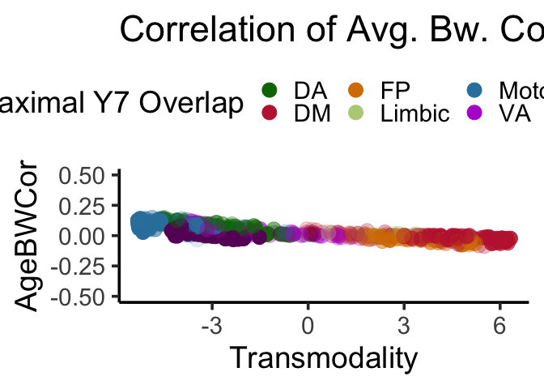

``` r
unibw_age_tm
```

    ## Warning: Removed 1 rows containing missing values (geom_point).

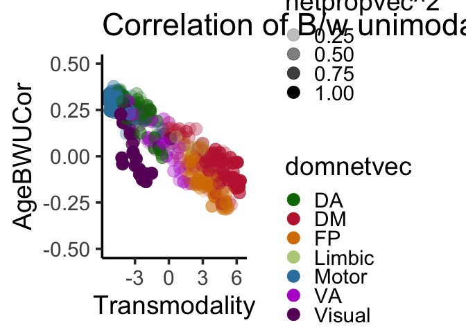

``` r
transbw_age_tm
```

    ## Warning: Removed 2 rows containing missing values (geom_point).

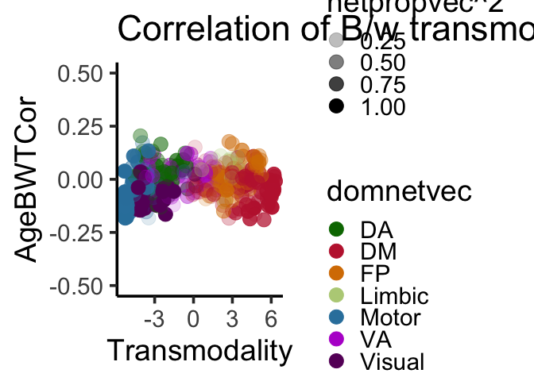

``` r
avgbw_age_scale
```

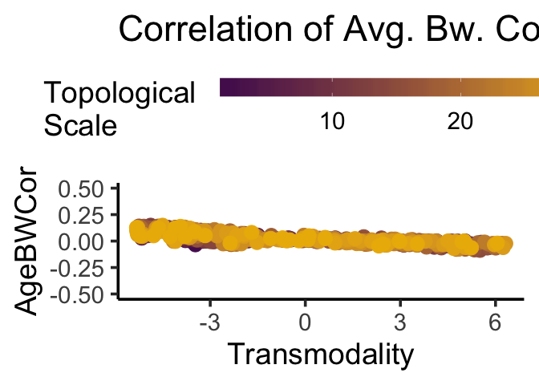

``` r
unibw_age_scale
```

    ## Warning: Removed 1 rows containing missing values (geom_point).

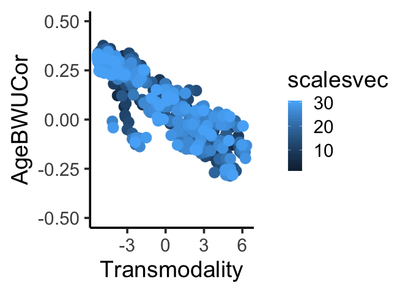

``` r
transbw_age_scale
```

    ## Warning: Removed 2 rows containing missing values (geom_point).

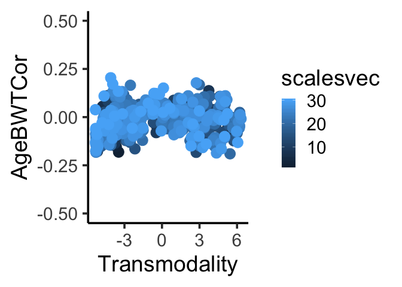

``` r
#17 network version
bwdf17<-data.frame(tmvec,scalesvec,domnetvec17,netpropvec17,bwAgeCorVecs$avg_bw,bwAgeCorVecs$bw_to_unimodal,bwAgeCorVecs$bw_to_transmodal)

Segreg_age_tm17<-ggplot(bwdf17,aes(tmvec,bwAgeCorVecs.avg_bw,color=domnetvec17,alpha=netpropvec17^2)) + scale_color_manual(values=c('#dc8303','#8d2049','#596a85','#2d9a3d','#007938','#d9e200','#bc0943','#2b1f67','#48593a','#91a967','#4183a8','#00bb89','#3245a3','#9e3ca2','#eb75b3','#68126f','#d1001c')) + xlab("Transmodality") + ylab("AgeB/WCor") +theme_classic(base_size = 28) + geom_point(size=4,aes(tmvec,bwAgeCorVecs.avg_bw)) + ggtitle('Correlation of B/w Con Avg and Age over All Communities')

Segreg_age_tm17
```

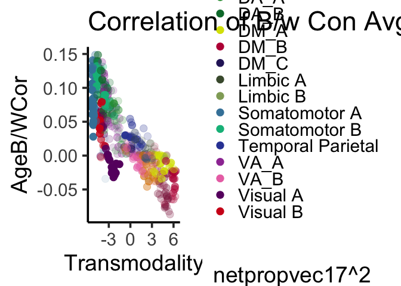
