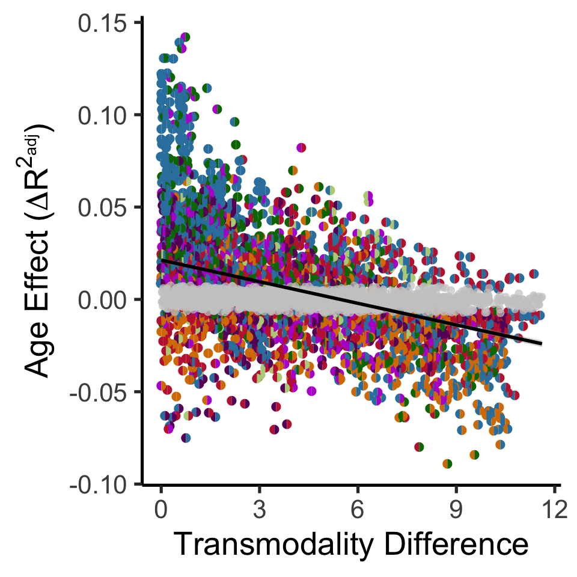
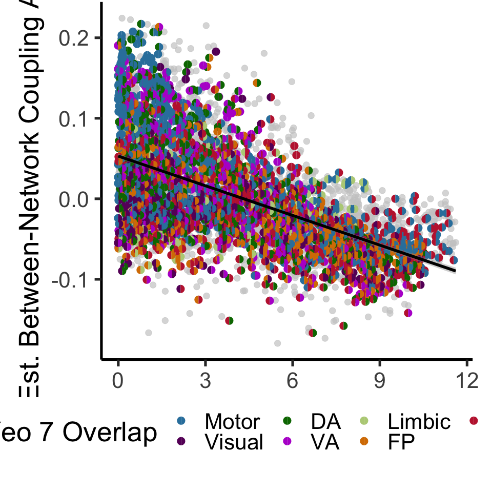
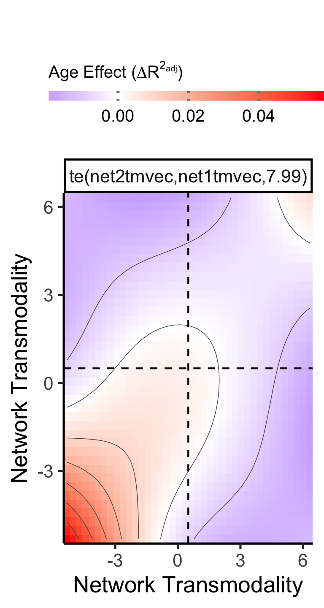

Edge-level-Age
================
Adam
1/19/2021

``` r
#libraries


library(mediation)
library(gratia)
library(ggplot2)
library(reshape2)
library(dplyr)
library(ggpubr)
library(vroom)
library(data.table)
library(mgcv)
library(ppcor)
library(viridis)
library(mgcViz)
library(pammtools)
```

``` r
# functions for delta r ^ 2
# difference in R2
DeltaR2EstVec<-function(x){
  
  # relevant df
  scaledf<-data.frame(cbind(as.numeric(masterdf$Age),as.numeric(masterdf$Sex),masterdf$Motion,x))
  colnames(scaledf)<-c('Age','Sex','Motion','varofint')
  
  # no-age model (segreg ~ sex + motion)
  noAgeGam<-gam(varofint~Sex+Motion,data=scaledf)
  noAgeSum<-summary(noAgeGam)
  # age-included model for measuring difference
  AgeGam<-gam(varofint~Sex+Motion+s(Age,k=3),data=scaledf)
  AgeSum<-summary(AgeGam)
  
  dif<-AgeSum$r.sq-noAgeSum$r.sq
  
  # partial spearmans to extract age relation (for direction)
  pspear=pcor(scaledf,method='spearman')$estimate
  corest<-pspear[4]
  if(corest<0){
    dif=dif*-1
  }
  
  return(dif)
  
}

# same thing but returning chisq test sig. output for FDR correction instead of hard difference
DeltaPEstVec<-function(x){
  
  # relevant df
  scaledf<-data.frame(cbind(as.numeric(masterdf$Age),as.numeric(masterdf$Sex),masterdf$Motion,x))
  colnames(scaledf)<-c('Age','Sex','Motion','varofint')
  
  # no-age model (segreg ~ sex + motion)
  noAgeGam<-gam(varofint~Sex+Motion,data=scaledf)
  # age-included model for measuring difference
  AgeGam<-gam(varofint~Sex+Motion+s(Age,k=3),data=scaledf)
  
  # test of dif with anova.gam
  anovaRes<-anova.gam(noAgeGam,AgeGam,test='Chisq')
  anovaP<-anovaRes$`Pr(>Chi)`
  anovaP2<-unlist(anovaP)
  return(anovaP2[2])
  
}
```

``` r
# load 'erry thang


### load in demograhics
demo<-read.csv('/cbica/projects/pinesParcels/data/pnc_demo.csv')
ageSex<-data.frame(demo$ageAtScan1,as.factor(demo$sex),demo$scanid,demo$bblid)
subjects<-read.csv('/cbica/projects/pinesParcels/data/participants.txt',header = F)

### Collapse Motion metric 
# read in
Rest_Motion_Data <- read.csv("/cbica/projects/pinesParcels/data/n1601_RestQAData_20170714.csv")
NBack_Motion_Data <- read.csv("/cbica/projects/pinesParcels/data/n1601_NBACKQAData_20181001.csv")
Idemo_Motion_Data <- read.csv("/cbica/projects/pinesParcels/data/n1601_idemo_FinalQA_092817.csv")
# combine
motmerge<-merge(Rest_Motion_Data,NBack_Motion_Data,by='bblid')
motmerge<-merge(motmerge,Idemo_Motion_Data,by='bblid')
motmerge$Motion <- (motmerge$restRelMeanRMSMotion + motmerge$nbackRelMeanRMSMotion + motmerge$idemoRelMeanRMSMotion)/3;
motiondf<-data.frame(motmerge$bblid,motmerge$Motion)
colnames(motiondf)<-c('bblid','Motion')

### combine non-fMR data
colnames(subjects)<-c("scanid")
colnames(ageSex)<-c("Age","Sex","scanid","bblid")
df<-merge(subjects,ageSex,by="scanid")
df<-merge(df,motiondf,by='bblid')

### community solutions guaged in this iteration
community_vec<-seq(2,30)

# big load - output of fc_to_csv.m (all coupling/FC data, pre-organized)
fc<-vroom('/cbica/projects/pinesParcels/results/aggregated_data/fc/master_fcfeats_rounded.csv')
```

    ## New names:
    ## * `` -> ...1

    ## Rows: 695
    ## Columns: 16,360
    ## Delimiter: ","
    ## dbl [16360]: ...1, bblid, ind_globseg_scale2, ind_globseg_scale3, ind_globseg_scale4, ind_globse...
    ## 
    ## Use `spec()` to retrieve the guessed column specification
    ## Pass a specification to the `col_types` argument to quiet this message

``` r
# First row gotta go
fc<-fc[-c(1)]
# isolate shams
shams<-fc[694:695,]
# Merge with non-fMR data into master data frame
masterdf<-merge(fc,df,by='bblid')

# add EF
subjbehav<-read.csv("~/Downloads/n9498_cnb_factor_scores_fr_20170202.csv")
ef<-data.frame(subjbehav$NAR_F1_Exec_Comp_Cog_Accuracy,subjbehav$bblid)
colnames(ef)<-c('EF','bblid')
# merge in
masteref<-merge(masterdf,ef,by='bblid')
# and include EF in masterdf - keep more redundant code between sections this way
masterdf<-masteref

### Get in Consensus-reference atlas correspondence
rac<-read.csv('/cbica/projects/pinesParcels/results/aggregated_data/fc/network_yCorrespondence_overscales.csv',stringsAsFactors = F)
scalesvec<-as.numeric(rac[2,])
domnetvec<-as.factor(rac[3,])
netpropvec<-as.numeric(rac[4,])
# 17 network version
rac17<-read.csv('/cbica/projects/pinesParcels/results/aggregated_data/fc/network_y17Correspondence_overscales.csv',stringsAsFactors = F)
scalesvec17<-as.numeric(rac17[2,])
domnetvec17<-as.factor(rac17[3,])
netpropvec17<-as.numeric(rac17[4,])

# and set consensus-reference colors, names
ycolors=c('#3281ab','#670068','#007500','#b61ad0','#b8cf86','#d77d00','#c1253c')
Y7vec<-c('Motor','Visual','DA','VA','Limbic','FP','DM')

#### read in transmodality
tm<-read.csv('/cbica/projects/pinesParcels/results/aggregated_data/fc/network_transmodality_overscales.csv',stringsAsFactors = F)
colnames(tm)<-tm[1,]
# aaaand remove it so we got everything in its right place
tm<-tm[-c(1),]
tmvec<-as.numeric(tm)
# use median transmodality value to split relatively bimodal distribution
medtrans<-median(tmvec)
# equivalent vector to be overwritten with binary classification of transmodality
tmclass<-tmvec
for (i in 1:length(tmclass)){
  if (tmvec[i]<= medtrans){
    tmclass[i]='unimodal'
  }else{
    tmclass[i]='transmodal'
  }
}
```

``` r
# parse fields of interest 


# indicators of processing stream
ind='ind'
gro='gro'
bts='bts'

# indicators of fc feature type
bwi='_bw_FC_'
wini='_win_FC_'
nsegi='_seg_scale'
#gsegi='_globseg_scale'

# indices of said indicators
indiv=grep(ind,colnames(masterdf))
#group=grep(gro,colnames(masterdf))
#basists=grep(bts,colnames(masterdf))
bwcol=grep(bwi,colnames(masterdf))
wincols=grep(wini,colnames(masterdf))
nsegcols=grep(nsegi,colnames(masterdf))
#gsegcols=grep(gsegi,colnames(masterdf))

### Using index combinations, get to dataframe of interest
indiv_bwcols_ind<-intersect(bwcol,indiv)
individ_scalebybw_df<-masterdf[,indiv_bwcols_ind]
bwcolnames<-colnames(individ_scalebybw_df)
indiv_nsegcols_ind<-intersect(nsegcols,indiv)
indiv_wincols_ind<-intersect(wincols,indiv)
individ_scalebywin_df<-masterdf[,indiv_wincols_ind]
# to later use wincolname -> bwcolname mapping to extrapolate if if network is unimodal or transmodal along bwcol indices
wincolnames<-colnames(individ_scalebywin_df)
```

``` r
# Framework for pairwise age patterns
# Transmodality Dif and Age-relation
indiv_bwcols_ind<-intersect(bwcol,indiv)
individ_scalebybw_df<-masterdf[,indiv_bwcols_ind]

# to later use wincolname -> bwcolname mapping to extrapolate if if network is unimodal or transmodal along bwcol indices
wincolnames<-colnames(individ_scalebywin_df)
bwcolnames<-colnames(individ_scalebybw_df)

# initialize empty tm difference vector and age effect vector - 10/9/20: EF vector 
# I guess append is just terribly slow. replace these with proper-length initializations
tmdifvec=rep(0,length(colnames(individ_scalebybw_df)))
ageEfvec=rep(0,length(colnames(individ_scalebybw_df)))
ageEfPvec=rep(0,length(colnames(individ_scalebybw_df)))
motionEfvec=rep(0,length(colnames(individ_scalebybw_df)))
motioncorvec<-rep(0,length(colnames(individ_scalebybw_df)))
Net1Vec=rep(0,length(colnames(individ_scalebybw_df)))
Net2Vec=rep(0,length(colnames(individ_scalebybw_df)))
Net1Vec17=rep(0,length(colnames(individ_scalebybw_df)))
Net2Vec17=rep(0,length(colnames(individ_scalebybw_df)))
ageDR2vec=rep(0,length(colnames(individ_scalebybw_df)))
ageDR2Pvec=rep(0,length(colnames(individ_scalebybw_df)))
# for recording net1 and net2 tm
net1tmvec=rep(0,length(colnames(individ_scalebybw_df)))
net2tmvec=rep(0,length(colnames(individ_scalebybw_df)))
# make a scale vector to match transmodality difference values
# this is to look at how finer scales confer networks that are less different
scalevec=rep(0,length(colnames(individ_scalebybw_df)))
# Intercept Vector
EdgeInterceptVector=rep(0,length(colnames(individ_scalebybw_df)))
# to get 8 y.o. intercept
gamPredictMeAt8<-data.frame(1,1)
# * 12 for months
gamPredictMeAt8$Age<-(96)
gamPredictMeAt8$Motion<-mean(masterdf$Motion)
gamPredictMeAt8$Sex<-2


#### This measures all the pairwise relations (edges)
## for all b/w cols - 10/9/20: EF added in.
for (i in 1:length(colnames(individ_scalebybw_df))){
    # extract column name. Will parse column name to determine nature of #connection
    curcolname<-colnames(individ_scalebybw_df)[i]
    splitname<-unlist(strsplit(curcolname,'_'))
    scalefield=splitname[4]
    net1field=splitname[5]
    net2field=splitname[7]
    # doctor up scale and net1field so they are exclusively the value of #interest
    scale=as.numeric(unlist(strsplit(scalefield,'e'))[2])
    net1=unlist(strsplit(net1field,'s'))[2]
    net2=net2field 
    # helping phriendly index
    K_start=((scale-1)*(scale))/2
    K_end=(((scale-1)*(scale))/2)+scale-1
    Kind<-K_start:K_end
    # get TM values of both nets at this scale
    tm1=tmvec[Kind[as.numeric(net1)]]
    tm2=tmvec[Kind[as.numeric(net2)]]
    net1tmvec[i]<-tm1
    net2tmvec[i]<-tm2
    # absolute value as directionality is meaningless here
    tmdif=abs(tm1-tm2)
    # get position in master df of this column (need to use \b for exact matches #only)
    # added first b 11-9, works if remove
    curcolnameexact<-paste('\\b',curcolname,'\\b',sep='')
    colindex<-grep(curcolnameexact,colnames(masterdf))
    
    # save to respective vectors
    tmdifvec[i]<-tmdif
    motioncorvec[i]<-cor.test(masterdf[,colindex],masterdf$Motion)$estimate
    # accompanying scalevec so we can look at the typical transmodality #difference at each scale
    scalevec[i]=scale
    
    # record Networks assayed in terms of yeo7
    y7lab1=domnetvec[Kind[as.numeric(net1)]]
    y7lab2=domnetvec[Kind[as.numeric(net2)]]
    y17lab1=domnetvec17[Kind[as.numeric(net1)]]
    y17lab2=domnetvec17[Kind[as.numeric(net2)]]
    Net1Vec[i]<-as.character(y7lab1)
    Net2Vec[i]<-as.character(y7lab2)
    Net1Vec17[i]<-as.character(y17lab1)
    Net2Vec17[i]<-as.character(y17lab2)
    
    # delta r2 for age
    ageDR2vec[i]<-DeltaR2EstVec(masterdf[,colindex])
    ageDR2Pvec[i]<-DeltaPEstVec(masterdf[,colindex])
    #####################################
    # get an intercept out here for Age
    scaledf<-data.frame(cbind(as.numeric(masterdf$Age),as.numeric(masterdf$Sex),masterdf$Motion,masterdf[,colindex]))
    colnames(scaledf)<-c('Age','Sex','Motion','varofint')
    # age-included model for measuring difference
    AgeGam<-gam(varofint~Sex+Motion+s(Age,k=3),data=scaledf)
    # record "intercept" (predicted at 8 y.o.)
    EdgeInterceptVector[i]<-predict.gam(AgeGam,gamPredictMeAt8)
}

# age corrections for MC
fdrAgeDR2<-p.adjust(ageDR2Pvec,method='fdr')
# use p values to make gray'ed mask
domnetSigAge1<-Net1Vec
domnetSigAge2<-Net2Vec
domnetSig1<-Net1Vec
domnetSig2<-Net2Vec

# sep. vectors to mark circles that are nonsig
levels(domnetSigAge1)<-c(levels(domnetSigAge1),'NonSig')
levels(domnetSigAge2)<-c(levels(domnetSigAge2),'NonSig')
domnetSigAge1[ageDR2Pvec>0.05]='NonSig'
domnetSigAge2[ageDR2Pvec>0.05]='NonSig'

# get vectors into a dataframe
BwAgeCorTMDifDf<-data.frame(tmdifvec,scalevec,Net1Vec,Net2Vec,Net1Vec17,Net2Vec17,fdrAgeDR2,ageDR2vec,domnetSig1,domnetSig2,domnetSigAge1,domnetSigAge2,net1tmvec,net2tmvec)
```

``` r
# get gam for stats
ageEdgeGam<-gam(ageDR2vec~s(tmdifvec,k=3),data=BwAgeCorTMDifDf)
```

``` r
# plot edge-wise age effects
ggplot(BwAgeCorTMDifDf,aes(x=tmdifvec,y=ageDR2vec))+ geom_text(data=BwAgeCorTMDifDf[BwAgeCorTMDifDf$fdrAgeDR2<0.05,],size=10,label="\u25D6",family="Arial Unicode MS",aes(x=tmdifvec,y=ageDR2vec,color=Net1Vec))+scale_color_manual(values=ycolors,limits=Y7vec)+geom_text(data=BwAgeCorTMDifDf[BwAgeCorTMDifDf$fdrAgeDR2<0.05,],aes(x=tmdifvec,y=ageDR2vec,color=Net2Vec),size=10,label="\u25D7",family="Arial Unicode MS")+geom_point(data=BwAgeCorTMDifDf[BwAgeCorTMDifDf$fdrAgeDR2>0.05,],aes(x=tmdifvec,y=ageDR2vec),color='grey80',size=4,alpha=.7)+theme(legend.position = "none") + xlab('Transmodality Difference') + ylab(expression(paste('Age Effect(',Delta,R^2[adj],')')))+theme_classic(base_size = 40)+theme(legend.position = "none")+geom_smooth(method='gam',formula = y~s(x,k=3),color='black',size=2)
```



``` r
# edge-wise 8 y.o. intercept
edgeInt<-data.frame(EdgeInterceptVector,tmdifvec,Net1Vec,Net2Vec,fdrAgeDR2)
# get gam for stats
ageEdgeIntGam<-gam(EdgeInterceptVector~s(tmdifvec,k=3),data=BwAgeCorTMDifDf)
```

``` r
ggplot(edgeInt,aes(x=tmdifvec,y=EdgeInterceptVector))+geom_point(data=edgeInt[edgeInt$fdrAgeDR2>0.05,],aes(x=tmdifvec,y=EdgeInterceptVector),alpha=.7,color='gray80',size=4)+theme_classic(base_size=40)+ geom_text(data=edgeInt[edgeInt$fdrAgeDR2<0.05,],aes(x=tmdifvec,y=EdgeInterceptVector,color=Net1Vec),size=10,label="\u25D6",family="Arial Unicode MS")+geom_text(data=edgeInt[edgeInt$fdrAgeDR2<0.05,],aes(x=tmdifvec,y=EdgeInterceptVector,color=Net2Vec),size=10,label="\u25D7",family="Arial Unicode MS")+scale_color_manual(values=ycolors,limits=Y7vec)+geom_smooth(method='gam',formula = y~s(x,k=3),color='black',size=2)+ylab("Initial Between-Community Coupling")+xlab("Transmodality Difference")+theme(plot.margin=margin(b=3.5,t=.1,l=1,r=1, unit='cm'),legend.position=c(.42,-.2),legend.direction = "horizontal")+guides(alpha=FALSE,color=guide_legend(title="Yeo 7 Overlap"))
```



``` r
# gam surface

# make a double df for symmetry - net1 and net2tmvec repeated in opposite ordering
BwAgeCorTMDifDf2<-BwAgeCorTMDifDf
BwAgeCorTMDifDf2$net1tmvec<-BwAgeCorTMDifDf$net2tmvec
BwAgeCorTMDifDf2$net2tmvec<-BwAgeCorTMDifDf$net1tmvec

# "stacked" df
doubleBwAgeCorTMDifDf<-rbind(BwAgeCorTMDifDf2,BwAgeCorTMDifDf)
```

    ## Warning in `[<-.factor`(`*tmp*`, ri, value = structure(c("DM", "Motor", :
    ## invalid factor level, NA generated

    ## Warning in `[<-.factor`(`*tmp*`, ri, value = structure(c("DM", "Motor", :
    ## invalid factor level, NA generated

    ## Warning in `[<-.factor`(`*tmp*`, ri, value = structure(c("DM", "Motor", :
    ## invalid factor level, NA generated

    ## Warning in `[<-.factor`(`*tmp*`, ri, value = structure(c("DM", "Motor", :
    ## invalid factor level, NA generated

``` r
# model the surface
g2 <- gam(ageDR2vec ~ te(net2tmvec,net1tmvec),data = doubleBwAgeCorTMDifDf)
```

``` r
gg_tensor(g2)+theme_classic(base_size = 40) +theme(legend.text=element_text(size=30),legend.key.width =unit(3.5,"cm"),legend.title = element_text(size=30))+scale_fill_gradient2(low = "blue",high = "red",mid = "white",midpoint = 0,name=expression(paste('Age Effect(',Delta,R^2[adj],')')),guide = guide_colorbar(legend.position='top',title.position="top",ticks.colour = "gray50", ticks.linewidth = 7))+ggtitle("")+xlab("Network Transmodality")+ylab("Network Transmodality")+geom_vline(xintercept = mean(range(doubleBwAgeCorTMDifDf$net1tmvec)),linetype='dashed',size=1.5)+geom_hline(yintercept = mean(range(doubleBwAgeCorTMDifDf$net1tmvec)),linetype='dashed',size=1.5)+theme(legend.position='top')
```

    ## Scale for 'fill' is already present. Adding another scale for 'fill', which
    ## will replace the existing scale.


