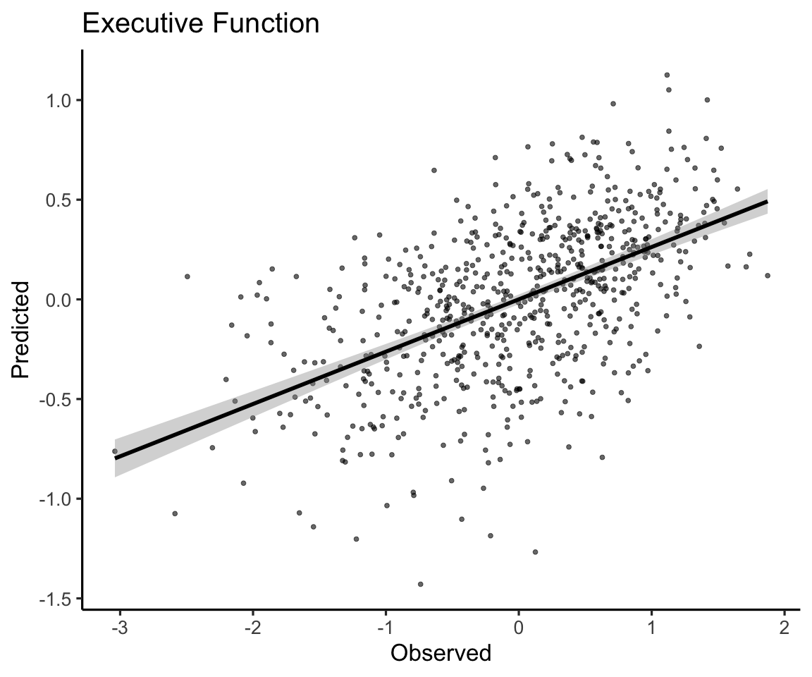

Edge-level-Age
================
Adam
1/19/2021

``` r
#libraries
library(vroom)
library(mgcv)
library(ggplot2)
library(hexbin)
library(ggExtra)
library(tidyverse)
library(Metrics)
```

``` r
### This script both writes out EF and FC values for ridge (scikit-learn), and reads the resulting predictions back in for visualization


###########
# pre-ridge
###########
```

``` r
### load in demograhics
demo<-read.csv('/cbica/projects/pinesParcels/data/pnc_demo.csv')
ageSex<-data.frame(demo$ageAtScan1,as.factor(demo$sex),demo$scanid,demo$bblid)
subjects<-read.csv('/cbica/projects/pinesParcels/data/participants.txt',header = F)
# get EF in here
subjbehav<-read.csv("~/Downloads/n9498_cnb_factor_scores_fr_20170202.csv")
ef<-data.frame(subjbehav$NAR_F1_Exec_Comp_Cog_Accuracy,subjbehav$bblid)

### Collapse Motion metric 
# read in
Rest_Motion_Data <- read.csv("/cbica/projects/pinesParcels/data/n1601_RestQAData_20170714.csv")
NBack_Motion_Data <- read.csv("/cbica/projects/pinesParcels/data/n1601_NBACKQAData_20181001.csv")
Idemo_Motion_Data <- read.csv("/cbica/projects/pinesParcels/data/n1601_idemo_FinalQA_092817.csv")
# combine
motmerge<-merge(Rest_Motion_Data,NBack_Motion_Data,by='bblid')
motmerge<-merge(motmerge,Idemo_Motion_Data,by='bblid')
motmerge$Motion <- (motmerge$restRelMeanRMSMotion + motmerge$nbackRelMeanRMSMotion + motmerge$idemoRelMeanRMSMotion)/3;
motiondf<-data.frame(motmerge$bblid,motmerge$Motion)
colnames(motiondf)<-c('bblid','Motion')

### combine non-fMR data
colnames(subjects)<-c("scanid")
colnames(ageSex)<-c("Age","Sex","scanid","bblid")
df<-merge(subjects,ageSex,by="scanid")
df<-merge(df,motiondf,by='bblid')

### community solutions guaged in this iteration
community_vec<-seq(2,30)

# big load - output of fc_to_csv.m (all coupling/FC data, pre-organized)
fc<-vroom('/cbica/projects/pinesParcels/results/aggregated_data/fc/master_fcfeats_rounded.csv')
```

    ## New names:
    ## * `` -> ...1

    ## Rows: 695
    ## Columns: 16,360
    ## Delimiter: ","
    ## dbl [16360]: ...1, bblid, ind_globseg_scale2, ind_globseg_scale3, ind_globseg_scale4, ind_globse...
    ## 
    ## Use `spec()` to retrieve the guessed column specification
    ## Pass a specification to the `col_types` argument to quiet this message

``` r
# First row gotta go
fc<-fc[-c(1)]
# isolate shams
shams<-fc[694:695,]
# Merge with non-fMR data into master data frame
masterdf<-merge(fc,df,by='bblid')
# add EF
subjbehav<-read.csv("~/Downloads/n9498_cnb_factor_scores_fr_20170202.csv")
ef<-data.frame(subjbehav$NAR_F1_Exec_Comp_Cog_Accuracy,subjbehav$bblid)
colnames(ef)<-c('F1_Exec_Comp_Cog_Accuracy','bblid')
# merge in
masteref<-merge(masterdf,ef,by='bblid')
```

``` r
# parse fields of interest 


# for parsing individualized partition values
ind='ind'

# for parsing specifically network edges
bwi='_bw_FC_'
wini='_win_FC_'
nsegi='_seg_scale'

# indices of said indicators
indiv=grep(ind,colnames(masterdf))
bwcol=grep(bwi,colnames(masterdf))
wincols=grep(wini,colnames(masterdf))
nsegcols=grep(nsegi,colnames(masterdf))

### Using index combinations, get to dataframe of interest
indiv_bwcols_ind<-intersect(bwcol,indiv)
individ_scalebybw_df<-masterdf[,indiv_bwcols_ind]
bwcolnames<-colnames(individ_scalebybw_df)
indiv_nsegcols_ind<-intersect(nsegcols,indiv)
indiv_wincols_ind<-intersect(wincols,indiv)
individ_scalebywin_df<-masterdf[,indiv_wincols_ind]
# to later use wincolname -> bwcolname mapping to extrapolate if if network is unimodal or transmodal along bwcol indices
wincolnames<-colnames(individ_scalebywin_df)
```

``` r
# regress motion and age out of EF
AgeMotRegrEF<-gam(F1_Exec_Comp_Cog_Accuracy~s(Age,k=3)+Motion,data=masteref)$residuals
# combine age and motion-controlled EF scores with edges
AgeIndepEF<-cbind(masterdf[,indiv_bwcols_ind],AgeMotRegrEF)
# write out for scikit learn
write.table(AgeIndepEF,'/cbica/projects/pinesParcels/results/EffectVecs/AgeIndepEF',sep=',', col.names = F,quote = F,row.names=F)

# use source activate mv_preds to load in required python libraries
# run penal_regresFC_AgeEFIndep.py
```

``` r
###########
# post-scikit-ridge
###########
```

``` r
# load in subject predictions. First column is sum of predicted EF from every instance in which this subject was randomly allocated to the testing 1/3rd. Second column is the number of times the subject was allocated to the testing 1.3rd.
predEF_AIcsv<-read.csv('/cbica/projects/pinesParcels/data/aggregated_data/SubjPreds_AI.csv',header=F)

# convert to average predicted EF over all folds
predEF_AI<-predEF_AIcsv[,1]/predEF_AIcsv[,2]

# pred ef vs. age. There should be no relationship if regressing Age out of EF scores worked.
plot(masteref$Age,predEF_AI)
```


``` r
cor.test(masteref$Age,predEF_AI)
```

    ## 
    ##  Pearson's product-moment correlation
    ## 
    ## data:  masteref$Age and predEF_AI
    ## t = 0.084636, df = 691, p-value = 0.9326
    ## alternative hypothesis: true correlation is not equal to 0
    ## 95 percent confidence interval:
    ##  -0.07127379  0.07767746
    ## sample estimates:
    ##         cor 
    ## 0.003219692

``` r
# pred ef vs. ef. There should be a relationship if our model was able to predict EF in unseen subjects.

plot(AgeMotRegrEF,predEF_AI)
```


``` r
# save the real predicted vs. observed correlation for plotting relative to null distribution
predObsCor<-cor.test(AgeMotRegrEF,predEF_AI)$estimate

# median absolute error also of interest.
mae(AgeMotRegrEF,predEF_AI)
```

    ## [1] 0.5532473

``` r
# get permutation prediction vs. observed correlations from permutation writeout
predEF_AIpermutCors<-read.csv('/cbica/projects/pinesParcels/data/aggregated_data/PermutPreds_AI.csv',header=F)

# Figure 6 flag
plotdf<-data.frame(AgeMotRegrEF,predEF_AI)
```

``` r
# edge-EF pred. permutation vs. observed
ggplot(predEF_AIpermutCors,aes(x=V1))+geom_density(size=1.5)+geom_vline(xintercept = predObsCor,size=2,color='#BC3754')+theme_classic(base_size=18)+ylab('')+xlab('')+guides(y="none")+scale_x_continuous(breaks=c(-.3,0,.3,.6),limits=c(-.35,.6))
```


``` r
ggplot(plotdf,aes(x=AgeMotRegrEF,y=predEF_AI)) +geom_point(size=2,alpha=.6)+geom_smooth(method='lm',color='black',size=2)+theme_classic(base_size=25) + xlab("Observed") + ylab("Predicted")+ggtitle('Executive Function')
```

    ## `geom_smooth()` using formula 'y ~ x'


