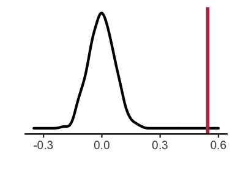

Edge-level-Age
================
Adam
1/19/2021

``` r
#libraries
library(vroom)
library(mgcv)
library(ggplot2)
library(hexbin)
library(ggExtra)
library(tidyverse)
library(Metrics)
```

``` r
### This script both writes out EF and FC values for ridge (scikit-learn), and reads the resulting predictions back in for visualization


###########
# pre-ridge
###########
```

``` r
### load in demograhics
demo<-read.csv('/cbica/projects/pinesParcels/data/pnc_demo.csv')
ageSex<-data.frame(demo$ageAtScan1,as.factor(demo$sex),demo$scanid,demo$bblid)
subjects<-read.csv('/cbica/projects/pinesParcels/data/participants.txt',header = F)
# get EF in here
subjbehav<-read.csv("~/Downloads/n9498_cnb_factor_scores_fr_20170202.csv")
ef<-data.frame(subjbehav$NAR_F1_Exec_Comp_Cog_Accuracy,subjbehav$bblid)

### Collapse Motion metric 
# read in
Rest_Motion_Data <- read.csv("/cbica/projects/pinesParcels/data/n1601_RestQAData_20170714.csv")
NBack_Motion_Data <- read.csv("/cbica/projects/pinesParcels/data/n1601_NBACKQAData_20181001.csv")
Idemo_Motion_Data <- read.csv("/cbica/projects/pinesParcels/data/n1601_idemo_FinalQA_092817.csv")
# combine
motmerge<-merge(Rest_Motion_Data,NBack_Motion_Data,by='bblid')
motmerge<-merge(motmerge,Idemo_Motion_Data,by='bblid')
motmerge$Motion <- (motmerge$restRelMeanRMSMotion + motmerge$nbackRelMeanRMSMotion + motmerge$idemoRelMeanRMSMotion)/3;
motiondf<-data.frame(motmerge$bblid,motmerge$Motion)
colnames(motiondf)<-c('bblid','Motion')

### combine non-fMR data
colnames(subjects)<-c("scanid")
colnames(ageSex)<-c("Age","Sex","scanid","bblid")
df<-merge(subjects,ageSex,by="scanid")
df<-merge(df,motiondf,by='bblid')

### community solutions guaged in this iteration
community_vec<-seq(2,30)

# big load - output of fc_to_csv.m (all coupling/FC data, pre-organized)
fc<-vroom('/cbica/projects/pinesParcels/results/aggregated_data/fc/master_fcfeats_rounded.csv')
```

    ## New names:
    ## * `` -> ...1

    ## Rows: 695
    ## Columns: 16,360
    ## Delimiter: ","
    ## dbl [16360]: ...1, bblid, ind_globseg_scale2, ind_globseg_scale3, ind_globseg_scale4, ind_globse...
    ## 
    ## Use `spec()` to retrieve the guessed column specification
    ## Pass a specification to the `col_types` argument to quiet this message

``` r
# First row gotta go
fc<-fc[-c(1)]
# isolate shams
shams<-fc[694:695,]
# Merge with non-fMR data into master data frame
masterdf<-merge(fc,df,by='bblid')
# add EF
subjbehav<-read.csv("~/Downloads/n9498_cnb_factor_scores_fr_20170202.csv")
#ef<-data.frame(subjbehav$F1_Exec_Comp_Cog_Accuracy,subjbehav$bblid)
ef<-data.frame(subjbehav$NAR_F1_Exec_Comp_Cog_Accuracy,subjbehav$bblid)
colnames(ef)<-c('F1_Exec_Comp_Cog_Accuracy','bblid')
# merge in
masteref<-merge(masterdf,ef,by='bblid')
```

``` r
# parse fields of interest 


# indicators of processing stream
ind='ind'
gro='gro'
bts='bts'

# indicators of fc feature type
bwi='_bw_FC_'
wini='_win_FC_'
nsegi='_seg_scale'
#gsegi='_globseg_scale'

# indices of said indicators
indiv=grep(ind,colnames(masterdf))
#group=grep(gro,colnames(masterdf))
#basists=grep(bts,colnames(masterdf))
bwcol=grep(bwi,colnames(masterdf))
wincols=grep(wini,colnames(masterdf))
nsegcols=grep(nsegi,colnames(masterdf))
#gsegcols=grep(gsegi,colnames(masterdf))

### Using index combinations, get to dataframe of interest
indiv_bwcols_ind<-intersect(bwcol,indiv)
individ_scalebybw_df<-masterdf[,indiv_bwcols_ind]
bwcolnames<-colnames(individ_scalebybw_df)
indiv_nsegcols_ind<-intersect(nsegcols,indiv)
indiv_wincols_ind<-intersect(wincols,indiv)
individ_scalebywin_df<-masterdf[,indiv_wincols_ind]
# to later use wincolname -> bwcolname mapping to extrapolate if if network is unimodal or transmodal along bwcol indices
wincolnames<-colnames(individ_scalebywin_df)
```

``` r
# regress motion out of EF
MotRegrEF<-gam(F1_Exec_Comp_Cog_Accuracy~Motion,data=masteref)$residuals
# regress motion and age out of EF
AgeMotRegrEF<-gam(F1_Exec_Comp_Cog_Accuracy~s(Age,k=3)+Motion,data=masteref)$residuals
AgeDepEF<-cbind(masterdf[,indiv_bwcols_ind],MotRegrEF)
AgeIndepEF<-cbind(masterdf[,indiv_bwcols_ind],AgeMotRegrEF)
write.table(AgeDepEF,'/cbica/projects/pinesParcels/results/EffectVecs/AgeDepEF',sep=',', col.names = F,quote = F,row.names=F)
write.table(AgeIndepEF,'/cbica/projects/pinesParcels/results/EffectVecs/AgeIndepEF',sep=',', col.names = F,quote = F,row.names=F)
```

``` r
# ridge - penal_regresFC_Age.py 
```

``` r
###########
# post-ridge
###########
```

``` r
predEF_AIcsv<-read.csv('/cbica/projects/pinesParcels/data/aggregated_data/SubjPreds_AI.csv',header=F)
# convert to average predicted EF over all folds
#predEF_ADcsv<-predEFcsv[,1]/predEFcsv[,2]
predEF_AI<-predEF_AIcsv[,1]/predEF_AIcsv[,2]
# pred ef vs. age
plot(masteref$Age,predEF_AI)
```



``` r
cor.test(masteref$Age,predEF_AI,method='spearman')
```

    ## Warning in cor.test.default(masteref$Age, predEF_AI, method = "spearman"):
    ## Cannot compute exact p-value with ties

    ## 
    ##  Spearman's rank correlation rho
    ## 
    ## data:  masteref$Age and predEF_AI
    ## S = 54765711, p-value = 0.7391
    ## alternative hypothesis: true rho is not equal to 0
    ## sample estimates:
    ##        rho 
    ## 0.01267262

``` r
# pred ef vs. ef
plot(AgeMotRegrEF,predEF_AI)
```


``` r
cor.test(AgeMotRegrEF,predEF_AI)
```

    ## 
    ##  Pearson's product-moment correlation
    ## 
    ## data:  AgeMotRegrEF and predEF_AI
    ## t = 16.542, df = 691, p-value < 2.2e-16
    ## alternative hypothesis: true correlation is not equal to 0
    ## 95 percent confidence interval:
    ##  0.4770637 0.5839297
    ## sample estimates:
    ##       cor 
    ## 0.5326162

``` r
mae(AgeMotRegrEF,predEF_AI)
```

    ## [1] 0.5532473

``` r
# setup for figure 6 pred. vs obs. ef
plotdf<-data.frame(AgeMotRegrEF,predEF_AI)
hexinfo <- hexbin(AgeMotRegrEF, predEF_AI, xbins = 20)
data_hex <- data.frame(hcell2xy(hexinfo), count = hexinfo@count)
colnames(data_hex)<-c('AgeMotRegrEF','predEF_AI','count')

# custom colormap
plasma_pal <- c("grey45", viridis::plasma(n = 25))


#plot_with_distributions<-ggMarginal(ggplot(plotdf,aes(x=AgeMotRegrEF,y=predEF_AI)) + geom_hex(bins=15) + scale_fill_viridis_c(option='plasma',rescaler = function(x, to = c(0, 1), from = NULL) {
#  ifelse(x<23,
#         scales::rescale(x,
#                         to=to,
#                         from=c(min(x,na.rm=T),23)),
#         1)})+geom_point(alpha=0)+geom_smooth(method='lm',color='gray')+theme_classic(base_size=40)+th#eme(legend.position = "left") + xlab("Observed") + ylab("Predicted")+ggtitle('Executive Function'))
```

``` r
ggplot(plotdf,aes(x=AgeMotRegrEF,y=predEF_AI)) + geom_hex(bins=15) + scale_fill_gradientn(colors=plasma_pal)+geom_point(alpha=0)+geom_smooth(method='lm',color='black',size=4)+theme_classic(base_size=25)+theme(legend.key.width = unit(2.1,"cm"),legend.position=c(.35,-.27),legend.direction = 'horizontal',plot.margin=margin(b=2.3,t=.1,l=.1,r=.1, unit='cm')) + xlab("Observed") + ylab("Predicted")+ggtitle('Executive Function')
```

    ## `geom_smooth()` using formula 'y ~ x'


``` r
#+guides(color=guide_legend(title="Yeo 7 Overlap"))+theme(plot.margin=margin(b=3,t=.1,l=.1,r=.1, unit='cm'), legend.position=c(.42,-.24),legend.direction = "horizontal",legend.title=element_text(size=30),legend.text=element_text(size=30))+geom_smooth(method='gam',formula = y~s(x,k=3),color='black')
```
