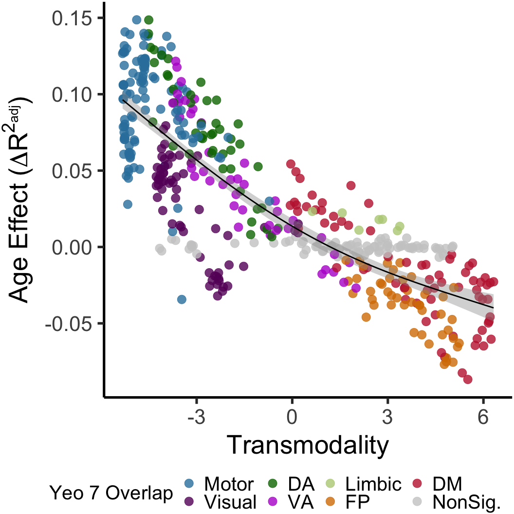

```r
#libraries


library(gratia)
library(ggplot2)
library(reshape2)
library(dplyr)
```

```
## 
## Attaching package: 'dplyr'
```

```
## The following objects are masked from 'package:stats':
## 
##     filter, lag
```

```
## The following objects are masked from 'package:base':
## 
##     intersect, setdiff, setequal, union
```

```r
library(ggpubr)
library(vroom)
library(data.table)
```

```
## 
## Attaching package: 'data.table'
```

```
## The following objects are masked from 'package:dplyr':
## 
##     between, first, last
```

```
## The following objects are masked from 'package:reshape2':
## 
##     dcast, melt
```

```r
library(mgcv)
```

```
## Loading required package: nlme
```

```
## 
## Attaching package: 'nlme'
```

```
## The following object is masked from 'package:dplyr':
## 
##     collapse
```

```
## This is mgcv 1.8-33. For overview type 'help("mgcv-package")'.
```

```r
library(ppcor)
```

```
## Loading required package: MASS
```

```
## 
## Attaching package: 'MASS'
```

```
## The following object is masked from 'package:dplyr':
## 
##     select
```


```r
# functions for age effect calculations

# difference in R2
DeltaR2EstVec<-function(x){
  
  # relevant df
  scaledf<-data.frame(cbind(as.numeric(masterdf$Age),as.numeric(masterdf$Sex),masterdf$Motion,x))
  colnames(scaledf)<-c('Age','Sex','Motion','varofint')
  
  # no-age model (segreg ~ sex + motion)
  noAgeGam<-gam(varofint~Sex+Motion,data=scaledf)
  noAgeSum<-summary(noAgeGam)
  # age-included model for measuring difference
  AgeGam<-gam(varofint~Sex+Motion+s(Age,k=3),data=scaledf)
  AgeSum<-summary(AgeGam)
  
  dif<-AgeSum$r.sq-noAgeSum$r.sq
  
  # partial spearmans to extract age relation (for direction)
  pspear=pcor(scaledf,method='spearman')$estimate
  corest<-pspear[4]
  if(corest<0){
    dif=dif*-1
  }
  
  return(dif)
  
}

# same thing but returning chisq test sig. output for FDR correction instead of hard difference
DeltaPEstVec<-function(x){
  
  # relevant df
  scaledf<-data.frame(cbind(as.numeric(masterdf$Age),as.numeric(masterdf$Sex),masterdf$Motion,x))
  colnames(scaledf)<-c('Age','Sex','Motion','varofint')
  
  # no-age model (segreg ~ sex + motion)
  noAgeGam<-gam(varofint~Sex+Motion,data=scaledf)
  # age-included model for measuring difference
  AgeGam<-gam(varofint~Sex+Motion+s(Age,k=3),data=scaledf)
  
  # test of dif with anova.gam
  anovaRes<-anova.gam(noAgeGam,AgeGam,test='Chisq')
  anovaP<-anovaRes$`Pr(>Chi)`
  anovaP2<-unlist(anovaP)
  return(anovaP2[2])
  
}
```


```r
# load 'erry thang


### load in demograhics
demo<-read.csv('/cbica/projects/pinesParcels/data/pnc_demo.csv')
ageSex<-data.frame(demo$ageAtScan1,as.factor(demo$sex),demo$scanid,demo$bblid)
subjects<-read.csv('/cbica/projects/pinesParcels/data/participants.txt',header = F)

### Collapse Motion metric 
# read in
Rest_Motion_Data <- read.csv("/cbica/projects/pinesParcels/data/n1601_RestQAData_20170714.csv")
NBack_Motion_Data <- read.csv("/cbica/projects/pinesParcels/data/n1601_NBACKQAData_20181001.csv")
Idemo_Motion_Data <- read.csv("/cbica/projects/pinesParcels/data/n1601_idemo_FinalQA_092817.csv")
# combine
motmerge<-merge(Rest_Motion_Data,NBack_Motion_Data,by='bblid')
motmerge<-merge(motmerge,Idemo_Motion_Data,by='bblid')
motmerge$Motion <- (motmerge$restRelMeanRMSMotion + motmerge$nbackRelMeanRMSMotion + motmerge$idemoRelMeanRMSMotion)/3;
motiondf<-data.frame(motmerge$bblid,motmerge$Motion)
colnames(motiondf)<-c('bblid','Motion')

### combine non-fMR data
colnames(subjects)<-c("scanid")
colnames(ageSex)<-c("Age","Sex","scanid","bblid")
df<-merge(subjects,ageSex,by="scanid")
df<-merge(df,motiondf,by='bblid')

### community solutions guaged in this iteration
community_vec<-seq(2,30)

# big load - output of fc_to_csv.m (all coupling/FC data, pre-organized)
fc<-vroom('/cbica/projects/pinesParcels/results/aggregated_data/fc/master_fcfeats_rounded.csv')
```

```
## New names:
## * `` -> ...1
## * Subjects -> Subjects...5455
## * Subjects -> Subjects...10908
```

```
## Rows: 695
## Columns: 16,360
## Delimiter: ","
## dbl [16360]: ...1, bblid, ind_globseg_scale2, ind_globseg_scale3, ind_globseg_scale4, ind_globse...
## 
## Use `spec()` to retrieve the guessed column specification
## Pass a specification to the `col_types` argument to quiet this message
```

```r
# First row gotta go
fc<-fc[-c(1)]
# isolate shams
shams<-fc[694:695,]
# Merge with non-fMR data into master data frame
masterdf<-merge(fc,df,by='bblid')

### Get in Consensus-reference atlas correspondence
rac<-read.csv('/cbica/projects/pinesParcels/results/aggregated_data/fc/network_yCorrespondence_overscales.csv',stringsAsFactors = F)
scalesvec<-as.numeric(rac[2,])
domnetvec<-as.factor(rac[3,])
netpropvec<-as.numeric(rac[4,])
# 17 network version
rac17<-read.csv('/cbica/projects/pinesParcels/results/aggregated_data/fc/network_y17Correspondence_overscales.csv',stringsAsFactors = F)
scalesvec17<-as.numeric(rac17[2,])
domnetvec17<-as.factor(rac17[3,])
netpropvec17<-as.numeric(rac17[4,])

#### read in transmodality
tm<-read.csv('/cbica/projects/pinesParcels/results/aggregated_data/fc/network_transmodality_overscales.csv',stringsAsFactors = F)
colnames(tm)<-tm[1,]
# aaaand remove it so we got everything in its right place
tm<-tm[-c(1),]
tmvec<-as.numeric(tm)
# use median transmodality value to split relatively bimodal distribution
medtrans<-median(tmvec)
# equivalent vector to be overwritten with binary classification of transmodality
tmclass<-tmvec
for (i in 1:length(tmclass)){
  if (tmvec[i]<= medtrans){
    tmclass[i]='unimodal'
  }else{
    tmclass[i]='transmodal'
  }
}
```


```r
# parse fields of interest 


# indicators of processing stream
ind='ind'
gro='gro'
bts='bts'

# indicators of fc feature type
bwi='_bw_FC_'
wini='_win_FC_'
nsegi='_seg_scale'
#gsegi='_globseg_scale'

# indices of said indicators
indiv=grep(ind,colnames(masterdf))
#group=grep(gro,colnames(masterdf))
#basists=grep(bts,colnames(masterdf))
bwcol=grep(bwi,colnames(masterdf))
wincols=grep(wini,colnames(masterdf))
nsegcols=grep(nsegi,colnames(masterdf))
#gsegcols=grep(gsegi,colnames(masterdf))

### Using index combinations, get to dataframe of interest
indiv_bwcols_ind<-intersect(bwcol,indiv)
individ_scalebybw_df<-masterdf[,indiv_bwcols_ind]
bwcolnames<-colnames(individ_scalebybw_df)
indiv_nsegcols_ind<-intersect(nsegcols,indiv)
indiv_wincols_ind<-intersect(wincols,indiv)
individ_scalebywin_df<-masterdf[,indiv_wincols_ind]
# to later use wincolname -> bwcolname mapping to extrapolate if if network is unimodal or transmodal along bwcol indices
wincolnames<-colnames(individ_scalebywin_df)
```


```r
# get average between-network connectivity of each network (average over each network's edges at each scale)


# empty array for each nets average b/w con across subjects
bwAvgCon<-matrix(0,693,464)
# loop over connectivities to-unimodal then to-transmodal
modalloopvar=c('unimodal','transmodal')
for (i in 1:2){
  print(modalloopvar[i])
  # index "the other"
  modalloopvar_other=modalloopvar[modalloopvar!=(modalloopvar[i])]
  # extract which of 1:464 network mappings match the modalitity of this loop
  modalindices=which(tmclass %in% modalloopvar[i])
  # loop over each scale
    for (K in 2:30){
    # Make index of where values from this K should go
      K_start=((K-1)*(K))/2
      K_end=(((K-1)*(K))/2)+K-1
      Kind<-K_start:K_end
    
    # index which values are at this scale
    scaleStr=paste('scale',K,'_',sep='')
    scaleCols_inds=grep(scaleStr,colnames(masterdf))
    scaleK_bw_indivi_cols_inds<-intersect(indiv_bwcols_ind,scaleCols_inds)
    # extract within and between colnames at this scale for within->b/w binarized transmodality mapping
    wincolnames_thisScale_inds<-grep((paste('scale',K,'_',sep='')),wincolnames)
    wincolnames_thisScale=wincolnames[wincolnames_thisScale_inds]
    bwcolnames_thisScale_inds<-grep((paste('scale',K,'_',sep='')),bwcolnames)
    bwcolnames_thisScale=bwcolnames[bwcolnames_thisScale_inds]
    
    # This was to double check that the "scale" grepping was selective enough
    # print(paste(scaleStr,'number of features:',length(bwcolnames_thisScale)))
  # one weird trick to get binarized transmodality class vector for same scale (Doctors hate him!)
    # tm naming aligns with wincon naming
    tmclasses_thisScale<-tmclass[wincolnames_thisScale_inds]
    # extract the network number of each network at this scale in same order as tmclasses_thisScale
    wincolNamesSplit<-strsplit(wincolnames_thisScale,"_net")
    wincolNames_net<-sapply(wincolNamesSplit, "[[" , 2)
    # mini matching vectors with network label at this scale in one col and transmodality binarization in the other
    tmMatchingVecs<-cbind(wincolNames_net,tmclasses_thisScale)
    # remove scale number from strings so we're not picking up on those
    bwcolnames_thisScale_split<-strsplit(bwcolnames_thisScale,"nets")
    bwnetnames_thisScale<-wincolNames_net<-sapply(bwcolnames_thisScale_split, "[[" , 2)
    # add another fucking set of underscores to all of these colnames so 1's dont pick up 10s
    bwnetnames_thisScale_extended<-paste('ind_bw_FC_scale',K,'_nets_',bwnetnames_thisScale,'_',sep='')
    # extra goddamn undercores have to go here and be removed later
    bwcolnames_thisScale_split<-strsplit(bwcolnames_thisScale,"nets")
    # to be matched in all-networks-at-this-scale loop
    # now as we descend into the third circle of for-loop hell, we find the guy from man vs.food being eaten alive by cerberus
    for (N in 1:K){
      # generate index for where values for this network at this scale should reside
      # start from K index
      Nind<-Kind[N]
      # get index for this N in terms of masterdf (collapse | to match multiple patterns)
      Ncolname<-grep(as.character(paste('_',N,'_',sep='')),bwnetnames_thisScale_extended,value=T)
      # need to add "_" before and after each number so I can select for '_N_' and not pick up teens digits with 1, 20s with 3, 15 and 25 with 5, etc.
      # determine if this network is transmodal or unimodal
      NModality<-tmMatchingVecs[,2][[N]]
      NotNModality<-modalloopvar[modalloopvar!=NModality]
      matchvec<-grep(NModality,tmclasses_thisScale)
      # remove self
      matchvec<-matchvec[matchvec!=N]
      # build index of matching modalities to reference masterdf (collapse | to match multiple patterns)
      matchTruncColName<-grep(as.character(paste('_',matchvec,'_',sep='',collapse="|")),Ncolname,value=T)
      # remove first and last characters now that we are specific
      #matchTruncColName<-sub('.$','',matchTruncColName)
      #matchTruncColName<-sub('.','',matchTruncColName)
      # deal with weird thing where empty space was being grepped because of its aspecificity at coarse scales
      if(length(matchTruncColName)==0){
        matchTruncColName[1]='CANTSEEME'
      }
      match_NetN_scaleK_bw_indivi_cols_ind_within_other_ind<-grep(as.character(paste(matchTruncColName,collapse="|")),bwnetnames_thisScale_extended)
      match_NetN_scaleK_bw_indivi_cols_names<-bwcolnames_thisScale[match_NetN_scaleK_bw_indivi_cols_ind_within_other_ind]
      # deep-sea grepping the whole paste and pipe thing is just to deal with character vectors instead of single patterns
      
      # deal with weird thing where empty space was being grepped because of its aspecificity
      if(length(match_NetN_scaleK_bw_indivi_cols_names)==0){
        match_NetN_scaleK_bw_indivi_cols_names[1]='CANTSEEME'
      }

      # added a faux '_' to end of column to col names can more selectively match numbers (not picking up on 20 when looking for 2, 2_ and 20_ more distinct)
      match_NetN_scaleK_bw_indivi_cols_ind<-grep(as.character(paste(match_NetN_scaleK_bw_indivi_cols_names,'_',sep='',collapse="|")),paste(colnames(masterdf),'_',sep=''))
    
  
      oppositevec<-grep(NotNModality,tmclasses_thisScale)
      
      # build index of NON-matching modalities to reference masterdf (collapse | to match multiple patterns)
      unmatchTruncColName<-grep(as.character(paste('_',oppositevec,'_',sep='',collapse="|")),Ncolname,value=T)
      # search for string in limited bwcolnames at this scale so as not to invite other scales into this grep party
      # remove first and last characters now that we are specific
      #unmatchTruncColName<-sub('.$','',unmatchTruncColName)
      #unmatchTruncColName<-sub('.','',unmatchTruncColName)
      unmatch_NetN_scaleK_bw_indivi_cols_names<-grep(as.character(paste(unmatchTruncColName,collapse="|")),bwnetnames_thisScale_extended,value=T)
      
      # deep-sea grepping the whole paste and pipe thing is just to deal with character vectors instead of single patterns
      unmatch_NetN_scaleK_bw_indivi_cols_ind_within_other_ind<-grep(as.character(paste(unmatch_NetN_scaleK_bw_indivi_cols_names,collapse="|")),bwnetnames_thisScale_extended)
      unmatch_NetN_scaleK_bw_indivi_cols_names<-bwcolnames_thisScale[unmatch_NetN_scaleK_bw_indivi_cols_ind_within_other_ind]
      unmatch_NetN_scaleK_bw_indivi_cols_ind<-grep(as.character(paste(unmatch_NetN_scaleK_bw_indivi_cols_names,'_',sep='',collapse="|")),paste(colnames(masterdf),'_',sep=''))
      
      
      # doublecheck that they are mutually exclusive (+1 because self-reference gets removed)
    #  if(length(tmclasses_thisScale)!=length(matchvec)+length(oppositevec)+1){
   #     print('You done goofed, internet police are on their way')
     # }
      if(length(tmclasses_thisScale)!=length(match_NetN_scaleK_bw_indivi_cols_ind)+length(unmatch_NetN_scaleK_bw_indivi_cols_ind)+1){
        print('Names dont add up chief')
        paste('match numbas', length(match_NetN_scaleK_bw_indivi_cols_ind), length(match_NetN_scaleK_bw_indivi_cols_names))
        paste('unmatch numbas', length(unmatch_NetN_scaleK_bw_indivi_cols_ind), length(unmatch_NetN_scaleK_bw_indivi_cols_names))
        stopifnot(length(tmclasses_thisScale)==length(match_NetN_scaleK_bw_indivi_cols_ind)+length(unmatch_NetN_scaleK_bw_indivi_cols_ind)+1)
      }
      
      # if it does not match the modality of the grandparent loop, we wish go assay its connections to opposite-modality networks
    # get average bw network connectivty age correlation for this network at this scale
      both=cbind(masterdf[,match_NetN_scaleK_bw_indivi_cols_ind],masterdf[,unmatch_NetN_scaleK_bw_indivi_cols_ind, drop=F])
      avg_bw=rowMeans(both)
      # for bw-based gams later - convert all b/w cons for a net to avg b/w for each subj
      bwAvgCon[,Nind]=avg_bw
    }
  }
  
}
```

```
## [1] "unimodal"
## [1] "transmodal"
```


```r
# calculate age effects


# set covariates formula for iterating over in the loop
covariates=" ~s(Age,k=3)+Sex+Motion"


# initialize output vectors
minAgeEst<-rep(0,length=length(masterdf[,indiv_nsegcols_ind]))
maxAgeEst<-rep(0,length=length(masterdf[,indiv_nsegcols_ind]))
SplineP<-rep(0,length=length(masterdf[,indiv_nsegcols_ind]))
InterceptVector10<-rep(0,length=length(masterdf[,indiv_nsegcols_ind]))
InterceptVector21<-rep(0,length=length(masterdf[,indiv_nsegcols_ind]))
derivInfo<-array(0,dim=c(464,200))
NetSplines<-array(0,dim=c(464,693)) 
avg_bw_deltaR2<-rep(0,length=length(masterdf[,indiv_nsegcols_ind]))
avg_bw_deltaP<-rep(0,length=length(masterdf[,indiv_nsegcols_ind]))

# for gam-predict 
gamPredictMeAt10<-data.frame(1,1)
gamPredictMeAt21<-data.frame(1,1)
# * 12 for months
gamPredictMeAt10$Age<-(120)
gamPredictMeAt10$Motion<-mean(masterdf$Motion)
# most PTs are females, female as default gender
gamPredictMeAt10$Sex<-2
gamPredictMeAt21$Age<-(252)
gamPredictMeAt21$Motion<-mean(masterdf$Motion)
gamPredictMeAt21$Sex<-2

# borrowing colnames from indiv_nsegcols to keep network/scale ordering/mappings
colnames(bwAvgCon)<-gsub("_seg_","_avgBw_",colnames(masterdf[,indiv_nsegcols_ind]))
bwAvgCondf<-data.frame(bwAvgCon)

#add on covariate columns
bwAvgCondf$Age<-masterdf$Age
bwAvgCondf$Sex<-masterdf$Sex
bwAvgCondf$Motion<-masterdf$Motion

#for i in 464, -3 because age sex motion columns sit at the end
for (i in 1:(length(bwAvgCondf)-3)){
  # borrowing colnames from indiv_nsegcols to keep network mappings
  x<-colnames(bwAvgCondf[i])
  avg_bw_deltaR2[i]<-DeltaR2EstVec(bwAvgCondf[i])
  avg_bw_deltaP[i]<-DeltaPEstVec(bwAvgCondf[i])
  form<-as.formula(paste("",x,"", covariates, sep=""))
  igam<-gam(formula = form,data=bwAvgCondf)
  SplineP[i]<-summary(igam)$s.pv
  # changed to get intercept at 10 and 20 years old
  InterceptVector10[i]<-predict.gam(igam,gamPredictMeAt10)
  InterceptVector21[i]<-predict.gam(igam,gamPredictMeAt21)
  derv<-derivatives(igam,term='Age')
  derv<- derv %>%
  mutate(sig = !(0 >lower & 0 < upper))
  derv$sig_deriv = derv$derivative*derv$sig
  if (all(derv$sig==FALSE)){minAgeEst[i]=0; maxAgeEst[i]=0
  } else {
  minAgeEst[i]<-min(derv$data[derv$sig==T])
  maxAgeEst[i]<-max(derv$data[derv$sig==T])
  # changed to sig deriv only 7/10/20
  derivInfo[i,]=derv$sig_deriv
  forSpline<-predict(igam, data = masterdf, type = "terms")
  # adding mean val because output values are centered
  colOfInt<-unlist(bwAvgCondf[,i])
  # version without centering
  NetSplines[i,]<-forSpline[,3]+coef(igam)[1]
  }
}

# fdr spline P's
SplineP_fdr<-p.adjust(SplineP,method='fdr')

# network-level sig vector
NL_sigVec<-logical(464)
NL_sigVec[SplineP_fdr<0.05]<-TRUE

# bring it all together
bwdf<-data.frame(tmvec,scalesvec,domnetvec,domnetvec17,netpropvec,avg_bw_deltaR2,avg_bw_deltaP)
```


```r
# Age * B/w - final setup
# Map nonsig to grey
bwdf$domnetvecSig<-'NonSig'
# sig where CL_vec indicates
bwdf$domnetvecSig[NL_sigVec]<-as.character(bwdf$domnetvec[NL_sigVec])
# order for plot legend
bwdf$domnetvecSig<-as.factor(bwdf$domnetvecSig)
bwdf$domnetvecSig<-factor(bwdf$domnetvecSig,levels=c("Motor","Visual","DA","VA","Limbic","FP","DM","NonSig"),labels=c("Motor","Visual","DA","VA","Limbic","FP","DM","NonSig."))
```


```r
ggplot(bwdf,aes(tmvec,avg_bw_deltaR2)) + geom_point(size=6,alpha=.8,aes(color=domnetvecSig))+ scale_color_manual(values=c('#3281ab','#670068','#007500','#b61ad0','#b8cf86','#d77d00','#c1253c','gray80')) + xlab("Transmodality") + ylab(expression(paste('Age Effect(',Delta,R^2[adj],')',sep=''))) +theme_classic(base_size = 40) +guides(color=guide_legend(title="Yeo 7 Overlap"))+theme(plot.margin=margin(b=3,t=.1,l=.1,r=.1, unit='cm'), legend.position=c(.42,-.24),legend.direction = "horizontal",legend.title=element_text(size=30),legend.text=element_text(size=30))+geom_smooth(method='lm',color='black',size=2)
```

```
## `geom_smooth()` using formula 'y ~ x'
```




```r
# Age Effect * Transmodality
```


```r
# Age Effect Derivatives * Age * Transmodality
```
