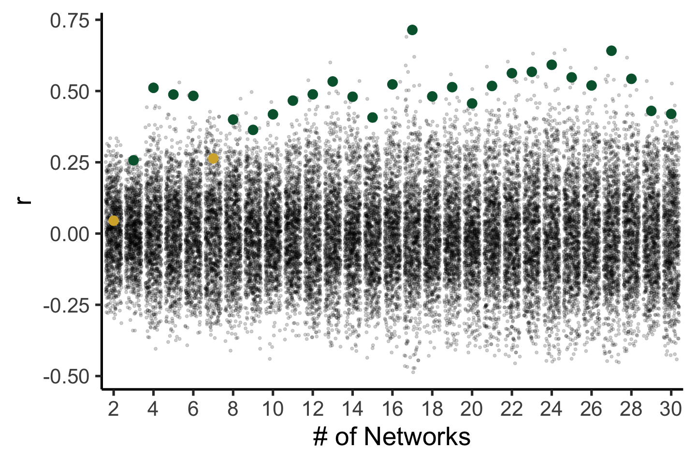

Vertex-level-MAD\_PG
================
Adam

``` r
library(ggplot2)
library(reshape2)
```

``` r
# load in spin test distributions for MAD and PG
spinDistr_PG_MAD<-read.csv('/cbica/projects/pinesParcels/results/aggregated_data/SpinTestDistrs_MAD_PG1.csv')
#plot real correlation over scales
plot(seq(2,30),unlist(spinDistr_PG_MAD[1,]),xlab='Scale',ylab='MAD Corr with PG')
```


``` r
# unpack the correlations vs. the spun correlations

# initialize array for MAD-PG correlations and p values
corvec=rep(0,29)
pvec=rep(0,29)

# melt this into 1001*29 columns 
m_spinDistr<-melt(spinDistr_PG_MAD)
```

    ## No id variables; using all as measure variables

``` r
# add a "scale" column
m_spinDistr$Scale<-rep(2:30,each=1001)
# add a "realCor" boolean column
repeatVector<-array(0,dim=c(1001,1))
repeatVector[1]<-1
m_spinDistr$RealCor<-rep(rep(c(1,0),c(1,1000)),times=29)
m_spinDistr$Scale<-as.factor(m_spinDistr$Scale)
# plot scales chosen for viz
for(K in seq(2,30)){
  m_spinDistr_Scale<-subset(m_spinDistr,Scale==K)
  RealCorrelation<-m_spinDistr_Scale$value[1]
  P_Value = length(which(m_spinDistr_Scale$value[2:1001] >= RealCorrelation)) / 1000;
  ggplot(subset(m_spinDistr_Scale, RealCor==0),aes(x=value))+geom_density()+geom_point(data = m_spinDistr_Scale[1,],aes(y=0),size=7,color='#BC3754')+theme_classic(base_size=40)+ylab('')+xlab(expression(rho))+guides(y="none")
  ggplot(subset(m_spinDistr_Scale, RealCor==0),aes(x=value))+geom_density(size=1.5)+geom_vline(xintercept =  RealCorrelation,size=2,color='#BC3754')+theme_classic(base_size=40)+ylab('')+xlab('r')+guides(y="none")
  print(paste("Scale",K,' Corr=',RealCorrelation,' uncorrected p=',P_Value,sep=''))
  # add values from scales 2:30 to places 1:29
  corvec[K-1]=RealCorrelation
  pvec[K-1]=P_Value
}
```

    ## [1] "Scale2 Corr=0.0451007708907127 uncorrected p=0.381"
    ## [1] "Scale3 Corr=0.256922334432602 uncorrected p=0.007"
    ## [1] "Scale4 Corr=0.511248707771301 uncorrected p=0"
    ## [1] "Scale5 Corr=0.48775652050972 uncorrected p=0.001"
    ## [1] "Scale6 Corr=0.48305144906044 uncorrected p=0.001"
    ## [1] "Scale7 Corr=0.263522058725357 uncorrected p=0.064"
    ## [1] "Scale8 Corr=0.399793595075607 uncorrected p=0.002"
    ## [1] "Scale9 Corr=0.36363822221756 uncorrected p=0.005"
    ## [1] "Scale10 Corr=0.418165355920792 uncorrected p=0.001"
    ## [1] "Scale11 Corr=0.466387361288071 uncorrected p=0.001"
    ## [1] "Scale12 Corr=0.488318383693695 uncorrected p=0.001"
    ## [1] "Scale13 Corr=0.533513009548187 uncorrected p=0.001"
    ## [1] "Scale14 Corr=0.479952752590179 uncorrected p=0.001"
    ## [1] "Scale15 Corr=0.407123357057571 uncorrected p=0.002"
    ## [1] "Scale16 Corr=0.523295521736145 uncorrected p=0.001"
    ## [1] "Scale17 Corr=0.714379727840424 uncorrected p=0"
    ## [1] "Scale18 Corr=0.481083035469055 uncorrected p=0.001"
    ## [1] "Scale19 Corr=0.513647973537445 uncorrected p=0.001"
    ## [1] "Scale20 Corr=0.456431686878204 uncorrected p=0.002"
    ## [1] "Scale21 Corr=0.517821907997131 uncorrected p=0.001"
    ## [1] "Scale22 Corr=0.562438249588013 uncorrected p=0.001"
    ## [1] "Scale23 Corr=0.56736809015274 uncorrected p=0.001"
    ## [1] "Scale24 Corr=0.592038452625275 uncorrected p=0.001"
    ## [1] "Scale25 Corr=0.547931492328644 uncorrected p=0.002"
    ## [1] "Scale26 Corr=0.519505679607391 uncorrected p=0.001"
    ## [1] "Scale27 Corr=0.641328930854797 uncorrected p=0.001"
    ## [1] "Scale28 Corr=0.542804002761841 uncorrected p=0.001"
    ## [1] "Scale29 Corr=0.430377572774887 uncorrected p=0.002"
    ## [1] "Scale30 Corr=0.419637203216553 uncorrected p=0.005"

``` r
# FDR correction on p-values
pvecFDR<-p.adjust(pvec,method='fdr')
# get binary significance for plotting (de-saturating)
MAD_PG_Sig<-rep(1,29)
MAD_PG_Sig[pvecFDR>0.01]<-0

# add significance vector to melted structure for de-saturating insig correlation values
m_spinDistr$Sig<-NULL
for(Scale in seq(2,30)){
  m_spinDistr$Sig[m_spinDistr$Scale==Scale]=MAD_PG_Sig[Scale-1]
}
```

``` r
# plot aggregate relations over scales
ggplot(m_spinDistr[m_spinDistr$RealCor==0,], aes(x = value, y = Scale, group = Scale))+xlab('r') + geom_jitter(size = 2,alpha=.25) +geom_text(data=m_spinDistr[m_spinDistr$RealCor==1,],aes(x=value,y=Scale),size=23,color='#BC3754',label="\u2015",family="Arial Unicode MS")+theme_classic(base_size = 40)+coord_flip()+theme(legend.position = "right")+ylab('# of Networks')+scale_y_discrete(breaks=seq(2,30,by=2))
```


