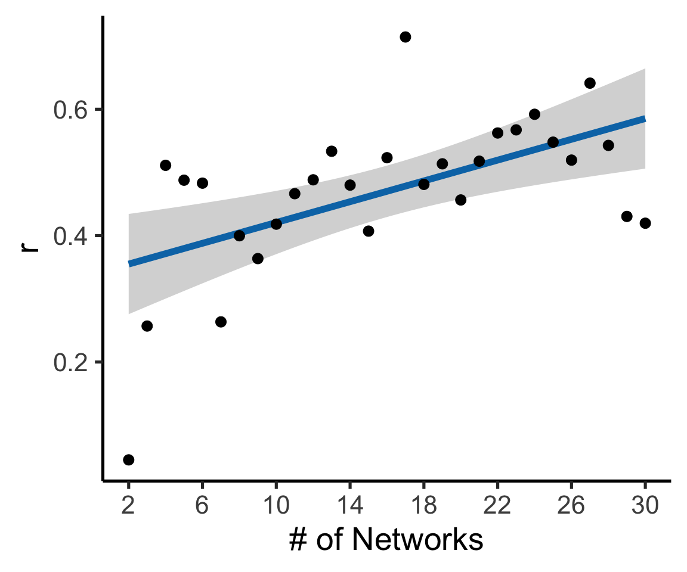

Vertex-level-MAD\_PG
================
Adam

``` r
library(ggplot2)
library(reshape2)
```

``` r
# load in spin test distributions for MAD and PG
spinDistr_PG_MAD<-read.csv('/cbica/projects/pinesParcels/results/aggregated_data/SpinTestDistrs_MAD_PG1.csv')
#plot real correlation over scales
plot(seq(2,30),unlist(spinDistr_PG_MAD[1,]),xlab='Scale',ylab='MAD Corr with PG')
```


``` r
# unpack the correlations vs. the spun correlations

# initialize array for MAD-PG correlations and p values
corvec=rep(0,29)
pvec=rep(0,29)

# melt this into 1001*29 columns 
m_spinDistr<-melt(spinDistr_PG_MAD)
```

    ## No id variables; using all as measure variables

``` r
# add a "scale" column
m_spinDistr$Scale<-rep(2:30,each=1001)
# add a "realCor" boolean column
repeatVector<-array(0,dim=c(1001,1))
repeatVector[1]<-1
m_spinDistr$RealCor<-rep(rep(c(1,0),c(1,1000)),times=29)
m_spinDistr$Scale<-as.factor(m_spinDistr$Scale)
# plot scales chosen for viz
for(K in seq(2,30)){
  m_spinDistr_Scale<-subset(m_spinDistr,Scale==K)
  RealCorrelation<-m_spinDistr_Scale$value[1]
  P_Value = length(which(m_spinDistr_Scale$value[2:1001] >= RealCorrelation)) / 1000;
  ggplot(subset(m_spinDistr_Scale, RealCor==0),aes(x=value))+geom_density()+geom_point(data = m_spinDistr_Scale[1,],aes(y=0),size=7,color='#BC3754')+theme_classic(base_size=40)+ylab('')+xlab(expression(rho))+guides(y="none")
  ggplot(subset(m_spinDistr_Scale, RealCor==0),aes(x=value))+geom_density(size=1.5)+geom_vline(xintercept =  RealCorrelation,size=2,color='#BC3754')+theme_classic(base_size=40)+ylab('')+xlab('r')+guides(y="none")
  print(paste("Scale",K,' Corr=',RealCorrelation,' uncorrected p=',P_Value,sep=''))
  # add values from scales 2:30 to places 1:29
  corvec[K-1]=RealCorrelation
  pvec[K-1]=P_Value
}
```

    ## [1] "Scale2 Corr=0.0451007708907127 uncorrected p=0.381"
    ## [1] "Scale3 Corr=0.256922334432602 uncorrected p=0.007"
    ## [1] "Scale4 Corr=0.511248707771301 uncorrected p=0"
    ## [1] "Scale5 Corr=0.48775652050972 uncorrected p=0.001"
    ## [1] "Scale6 Corr=0.48305144906044 uncorrected p=0.001"
    ## [1] "Scale7 Corr=0.263522058725357 uncorrected p=0.064"
    ## [1] "Scale8 Corr=0.399793595075607 uncorrected p=0.002"
    ## [1] "Scale9 Corr=0.36363822221756 uncorrected p=0.005"
    ## [1] "Scale10 Corr=0.418165355920792 uncorrected p=0.001"
    ## [1] "Scale11 Corr=0.466387361288071 uncorrected p=0.001"
    ## [1] "Scale12 Corr=0.488318383693695 uncorrected p=0.001"
    ## [1] "Scale13 Corr=0.533513009548187 uncorrected p=0.001"
    ## [1] "Scale14 Corr=0.479952752590179 uncorrected p=0.001"
    ## [1] "Scale15 Corr=0.407123357057571 uncorrected p=0.002"
    ## [1] "Scale16 Corr=0.523295521736145 uncorrected p=0.001"
    ## [1] "Scale17 Corr=0.714379727840424 uncorrected p=0"
    ## [1] "Scale18 Corr=0.481083035469055 uncorrected p=0.001"
    ## [1] "Scale19 Corr=0.513647973537445 uncorrected p=0.001"
    ## [1] "Scale20 Corr=0.456431686878204 uncorrected p=0.002"
    ## [1] "Scale21 Corr=0.517821907997131 uncorrected p=0.001"
    ## [1] "Scale22 Corr=0.562438249588013 uncorrected p=0.001"
    ## [1] "Scale23 Corr=0.56736809015274 uncorrected p=0.001"
    ## [1] "Scale24 Corr=0.592038452625275 uncorrected p=0.001"
    ## [1] "Scale25 Corr=0.547931492328644 uncorrected p=0.002"
    ## [1] "Scale26 Corr=0.519505679607391 uncorrected p=0.001"
    ## [1] "Scale27 Corr=0.641328930854797 uncorrected p=0.001"
    ## [1] "Scale28 Corr=0.542804002761841 uncorrected p=0.001"
    ## [1] "Scale29 Corr=0.430377572774887 uncorrected p=0.002"
    ## [1] "Scale30 Corr=0.419637203216553 uncorrected p=0.005"

``` r
# FDR correction on p-values
pvecFDR<-p.adjust(pvec,method='fdr')
# get binary significance for plotting (de-saturating)
MAD_PG_Sig<-rep(1,29)
MAD_PG_Sig[pvecFDR>0.01]<-0

# add significance vector to melted structure for de-saturating insig correlation values
m_spinDistr$Sig<-NULL
for(Scale in seq(2,30)){
  m_spinDistr$Sig[m_spinDistr$Scale==Scale]=MAD_PG_Sig[Scale-1]
}
```

``` r
# plot aggregate relations over scales
ggplot(m_spinDistr[m_spinDistr$RealCor==0,], aes(x = value, y = Scale, group = Scale))+xlab('r') + geom_jitter(size = 2,alpha=.2) +geom_point(data=m_spinDistr[m_spinDistr$RealCor==1,],aes(x=value,y=Scale,color=factor(Sig)),size=7)+scale_color_manual(values=c('#d4af37', '#01613b'))+theme_classic(base_size = 40)+coord_flip()+theme(legend.position = "none")+ylab('# of Networks')+scale_y_discrete(breaks=seq(2,30,by=2))
```


``` r
skinnydf<-m_spinDistr[m_spinDistr$RealCor==1,]
ggplot(skinnydf,aes(x=(as.numeric(Scale)+1),y=value))  +geom_smooth(method='lm',color='#0376B5',size=4)+geom_point(size=6)+theme_classic(base_size=40) + xlab('# of Networks') + ylab('r')+scale_x_continuous(breaks=seq(2,30,by=4))
```

    ## `geom_smooth()` using formula 'y ~ x'



``` r
print(cor.test(as.numeric(skinnydf$Scale),skinnydf$value))
```

    ## 
    ##  Pearson's product-moment correlation
    ## 
    ## data:  as.numeric(skinnydf$Scale) and skinnydf$value
    ## t = 3.4703, df = 27, p-value = 0.001763
    ## alternative hypothesis: true correlation is not equal to 0
    ## 95 percent confidence interval:
    ##  0.2371543 0.7659761
    ## sample estimates:
    ##       cor 
    ## 0.5553866

``` r
# bootstrap section for 2C
OG_MADPGCorr_by_scale_model<-lm(as.numeric(Scale)~value,data=skinnydf)
# Extract Linear coef.
OG_MADPGCorr_by_scale_model_LIN<-summary(OG_MADPGCorr_by_scale_model)$coefficients['value',]
OG_MADPGCorr_by_scale_model_LIN_beta<-OG_MADPGCorr_by_scale_model_LIN['Estimate']


### After bootstrapping on Cubic
r1=read.csv('/cbica/projects/pinesParcels/multiscale/scripts/derive_spatialprops/PGMAD_Boot_ScaleBetas1.csv')
r2=read.csv('/cbica/projects/pinesParcels/multiscale/scripts/derive_spatialprops/PGMAD_Boot_ScaleBetas2.csv')
r3=read.csv('/cbica/projects/pinesParcels/multiscale/scripts/derive_spatialprops/PGMAD_Boot_ScaleBetas3.csv')
r4=read.csv('/cbica/projects/pinesParcels/multiscale/scripts/derive_spatialprops/PGMAD_Boot_ScaleBetas4.csv')
r5=read.csv('/cbica/projects/pinesParcels/multiscale/scripts/derive_spatialprops/PGMAD_Boot_ScaleBetas5.csv')
r6=read.csv('/cbica/projects/pinesParcels/multiscale/scripts/derive_spatialprops/PGMAD_Boot_ScaleBetas6.csv')
r7=read.csv('/cbica/projects/pinesParcels/multiscale/scripts/derive_spatialprops/PGMAD_Boot_ScaleBetas7.csv')
r8=read.csv('/cbica/projects/pinesParcels/multiscale/scripts/derive_spatialprops/PGMAD_Boot_ScaleBetas8.csv')
r9=read.csv('/cbica/projects/pinesParcels/multiscale/scripts/derive_spatialprops/PGMAD_Boot_ScaleBetas9.csv')
r10=read.csv('/cbica/projects/pinesParcels/multiscale/scripts/derive_spatialprops/PGMAD_Boot_ScaleBetas10.csv')
r11=read.csv('/cbica/projects/pinesParcels/multiscale/scripts/derive_spatialprops/PGMAD_Boot_ScaleBetas11.csv')
r12=read.csv('/cbica/projects/pinesParcels/multiscale/scripts/derive_spatialprops/PGMAD_Boot_ScaleBetas12.csv')
r13=read.csv('/cbica/projects/pinesParcels/multiscale/scripts/derive_spatialprops/PGMAD_Boot_ScaleBetas13.csv')
r14=read.csv('/cbica/projects/pinesParcels/multiscale/scripts/derive_spatialprops/PGMAD_Boot_ScaleBetas14.csv')
r15=read.csv('/cbica/projects/pinesParcels/multiscale/scripts/derive_spatialprops/PGMAD_Boot_ScaleBetas15.csv')
r16=read.csv('/cbica/projects/pinesParcels/multiscale/scripts/derive_spatialprops/PGMAD_Boot_ScaleBetas16.csv')
r17=read.csv('/cbica/projects/pinesParcels/multiscale/scripts/derive_spatialprops/PGMAD_Boot_ScaleBetas17.csv')
r18=read.csv('/cbica/projects/pinesParcels/multiscale/scripts/derive_spatialprops/PGMAD_Boot_ScaleBetas18.csv')
r19=read.csv('/cbica/projects/pinesParcels/multiscale/scripts/derive_spatialprops/PGMAD_Boot_ScaleBetas19.csv')
r20=read.csv('/cbica/projects/pinesParcels/multiscale/scripts/derive_spatialprops/PGMAD_Boot_ScaleBetas20.csv')

# split string to take out tab-delim'd column number, select second item (non-column number boot value)
r1=sapply(strsplit(r1$x,' '), `[`,2)
r2=sapply(strsplit(r2$x,' '), `[`,2)
r3=sapply(strsplit(r3$x,' '), `[`,2)
r4=sapply(strsplit(r4$x,' '), `[`,2)
r5=sapply(strsplit(r5$x,' '), `[`,2)
r6=sapply(strsplit(r6$x,' '), `[`,2)
r7=sapply(strsplit(r7$x,' '), `[`,2)
r8=sapply(strsplit(r8$x,' '), `[`,2)
r9=sapply(strsplit(r9$x,' '), `[`,2)
r10=sapply(strsplit(r10$x,' '), `[`,2)
r11=sapply(strsplit(r11$x,' '), `[`,2)
r12=sapply(strsplit(r12$x,' '), `[`,2)
r13=sapply(strsplit(r13$x,' '), `[`,2)
r14=sapply(strsplit(r14$x,' '), `[`,2)
r15=sapply(strsplit(r15$x,' '), `[`,2)
r16=sapply(strsplit(r16$x,' '), `[`,2)
r17=sapply(strsplit(r17$x,' '), `[`,2)
r18=sapply(strsplit(r18$x,' '), `[`,2)
r19=sapply(strsplit(r19$x,' '), `[`,2)
r20=sapply(strsplit(r20$x,' '), `[`,2)

# extract first 50
r1=r1[1:50]
r2=r2[1:50]
r3=r3[1:50]
r4=r4[1:50]
r5=r5[1:50]
r6=r6[1:50]
r7=r7[1:50]
r8=r8[1:50]
r9=r9[1:50]
r10=r10[1:50]
r11=r11[1:50]
r12=r12[1:50]
r13=r13[1:50]
r14=r14[1:50]
r15=r15[1:50]
r16=r16[1:50]
r17=r17[1:50]
r18=r18[1:50]
r19=r19[1:50]
r20=r20[1:50]

# slap 'em back together (all ran on different seeds)
mergedBootStraps<-as.numeric(cbind(r1,r2,r3,r4,r5,r6,r7,r8,r9,r10,r11,r12,r13,r14,r15,r16,r17,r18,r19,r20))

# range of Scale~MAD*PG Corr
print(range(mergedBootStraps))
```

    ## [1] 36.09494 39.93656

``` r
# for linear - significance
CI_LIN=quantile(mergedBootStraps,c(0.025,0.975)) 
# discrete p calculation (https://www.bmj.com/content/343/bmj.d2304 as source)
SE=(CI_LIN[2]-CI_LIN[1])/(2*1.96)
z=OG_MADPGCorr_by_scale_model_LIN_beta/SE
z=abs(z)
pLIN<-exp((-0.717*z)-(0.416*(z^2)))
# print out p-value of linear association between Scale and MAD*PG Correlation
print(pLIN)
```

    ## Estimate 
    ##        0
