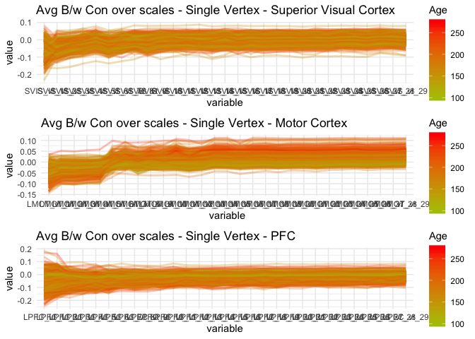

ExampleVerts
================
Adam
9/2/2020

``` r
library(rmarkdown)
library(reshape)
library(ggplot2)
```

    ## Warning: package 'ggplot2' was built under R version 3.5.2

``` r
library(ggpubr)
```

    ## Warning: package 'ggpubr' was built under R version 3.5.2

    ## Loading required package: magrittr

``` r
# load in demographic data
demo<-read.csv('/cbica/projects/pinesParcels/data/pnc_demo.csv')
ageSex<-data.frame(demo$ageAtScan1,as.factor(demo$sex),demo$scanid,demo$bblid)
colnames(ageSex)[4]<-'bblid'
colnames(ageSex)[1]<-'Age'

SupVisVert<-read.csv('/cbica/projects/pinesParcels/results/exampleVertVisbw.csv')
MotVert<-read.csv('/cbica/projects/pinesParcels/results/exampleVertMotbw.csv')
PFCVert<-read.csv('/cbica/projects/pinesParcels/results/exampleVertPFCbw.csv')

colnames(SupVisVert)[30]<-'bblid'
colnames(MotVert)[30]<-'bblid'
colnames(PFCVert)[30]<-'bblid'

df_SupVisVert<-merge(ageSex,SupVisVert,by="bblid")
df_MotVert<-merge(ageSex,MotVert,by="bblid")
df_PFCVert<-merge(ageSex,PFCVert,by="bblid")

mdf_SupVisVert<-melt(df_SupVisVert,id=c(1,2,3,4))
mdf_MotVert<-melt(df_MotVert,id=c(1,2,3,4))
mdf_PFCVert<-melt(df_PFCVert,id=c(1,2,3,4))


# create plots
visplot<-ggplot(data=mdf_SupVisVert,aes(x=variable,y=value,group=bblid,color=Age)) +geom_line(alpha = 0.3,size=1)+ scale_color_gradient2(low = "green", mid = 'green', high = "red") + theme_minimal()+labs(title="Avg B/w Con over scales - Single Vertex - Superior Visual Cortex")


motplot<-ggplot(data=mdf_MotVert,aes(x=variable,y=value,group=bblid,color=Age)) +geom_line(alpha = 0.3,size=1)+ scale_color_gradient2(low = "green", mid = 'green', high = "red") + theme_minimal()+labs(title="Avg B/w Con over scales - Single Vertex - Motor Cortex")

pfcplot<-ggplot(data=mdf_PFCVert,aes(x=variable,y=value,group=bblid,color=Age)) +geom_line(alpha = 0.3,size=1)+ scale_color_gradient2(low = "green", mid = 'green', high = "red") + theme_minimal()+labs(title="Avg B/w Con over scales - Single Vertex - PFC ")

ggarrange(visplot,motplot,pfcplot,ncol=1,nrow=3)
```



``` r
write.csv(mdf_SupVisVert,'~/Desktop/multiscale/long_upperVisVert.csv')
write.csv(mdf_MotVert,'~/Desktop/multiscale/long_MotVert.csv')
write.csv(mdf_PFCVert,'~/Desktop/multiscale/long_PFCVert.csv')
```
